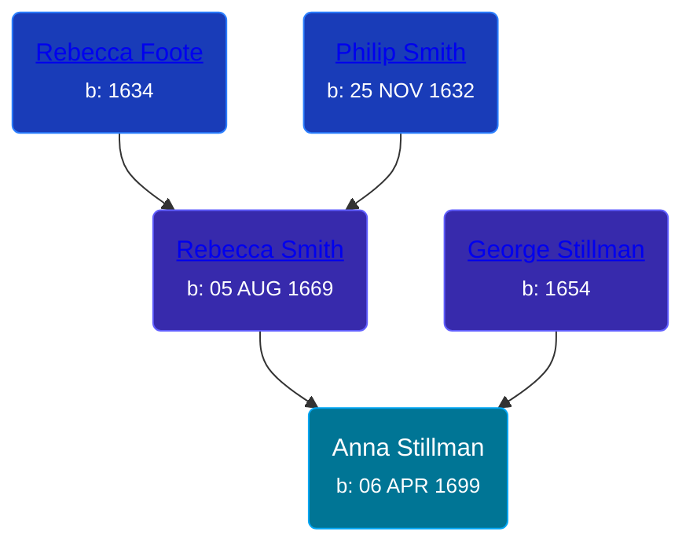

## 🟣 Anna Stillman
<small>Age: 68y, 7m, 1d</small>

Daughter of [George Stillman](/people/6/67040632) and [Rebecca Smith](/people/7/76162584)





### 📆 Events


Type | Date | Age at Event | Place
------ | ------ | ------ | ------
[Birth](#event-event-2) | 06 APR 1699 |  | Hadley, Massachusetts, USA
[Death](#event-event-3) | 07 NOV 1767 | 68y, 7m, 1d | Wethersfield, Connecticut, USA



- **[Birth](#event-event-2)**
**Date**: 06 APR 1699, Age:
**Place**: Hadley, Massachusetts, USA
- **[Death](#event-event-3)**
**Date**: 07 NOV 1767, Age: 68y, 7m, 1d
**Place**: Wethersfield, Connecticut, USA


## 👩‍❤️‍👨 Relationships

### 🔵 [Living Person](/people/7/73658198)

#### Children With Living Person
* 🟣 [Living Person](/people/9/9854708)
### 📰 Event Sources

####  Birth, 06 APR 1699
* The Foote Family: or the Descendants of Nathaniel Foote  - 279

####  Death, 07 NOV 1767
* Ancestry of George W. Bush