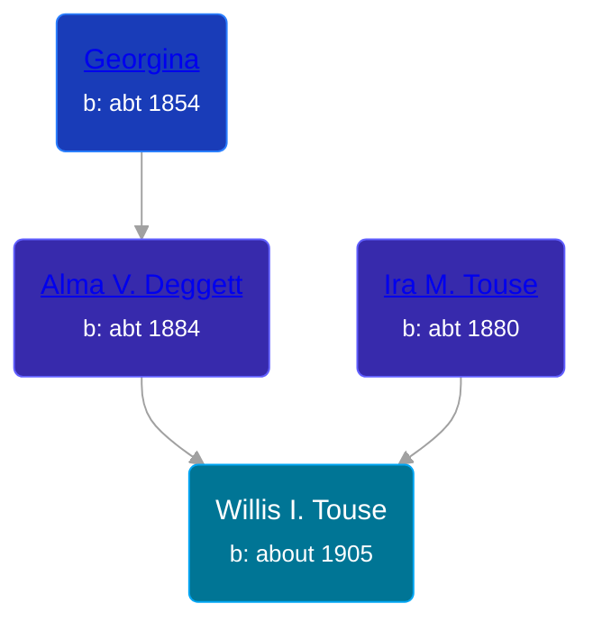

## 🔵 Willis I. Touse

Son of [Ira M. Touse](/people/4/43588740) and [Alma V. Deggett](/people/4/42271632)





### 📆 Events


Type | Date | Age at Event | Place
------ | ------ | ------ | ------
Birth | about 1905 |  | Michigan, USA
[Residence](#event-event-0) | 07 MAY 1910 | 5y, 5m, 7d |
[Residence](#event-event-1) | 21 JAN 1920 | 15y, 1m, 21d | Somerset Township, Hillsdale, Michigan, USA



- **Birth**
**Date**: about 1905, Age:
**Place**: Michigan, USA
- **[Residence](#event-event-0)**
**Date**: 07 MAY 1910, Age: 5y, 5m, 7d
**Place**:
- **[Residence](#event-event-1)**
**Date**: 21 JAN 1920, Age: 15y, 1m, 21d
**Place**: Somerset Township, Hillsdale, Michigan, USA


### 📰 Event Sources

####  Residence, 07 MAY 1910
* 1910 US Census

####  Residence, 21 JAN 1920
* 1920 US Census

