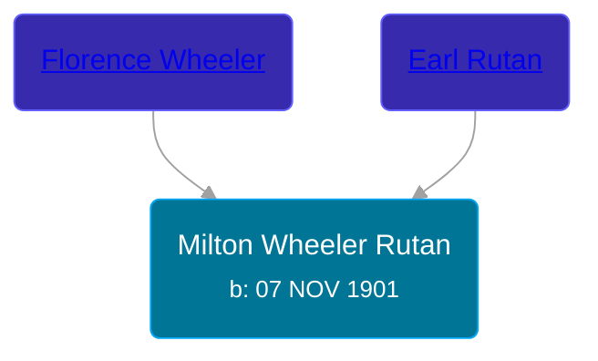

## 🔵 Milton Wheeler Rutan
<small>Age: 48y, 6m, 4d</small>

Son of [Earl Rutan](/people/2/29949376) and [Florence Wheeler](/people/4/48964520)





### 📆 Events


Type | Date | Age at Event | Place
------ | ------ | ------ | ------
[Birth](#event-event-2) | 07 NOV 1901 |  | Somerset Township, Hillsdale, Michigan, USA
[Residence](#event-event-0) | 10 APR 1940 | 38y, 5m, 3d | Napolean, Jackson, Michigan, USA
[Death](#event-event-4) | 11 MAY 1950 | 48y, 6m, 4d | Jackson, Jackson, Michigan, USA



- **[Birth](#event-event-2)**
**Date**: 07 NOV 1901, Age:
**Place**: Somerset Township, Hillsdale, Michigan, USA
- **[Residence](#event-event-0)**
**Date**: 10 APR 1940, Age: 38y, 5m, 3d
**Place**: Napolean, Jackson, Michigan, USA
- **[Death](#event-event-4)**
**Date**: 11 MAY 1950, Age: 48y, 6m, 4d
**Place**: Jackson, Jackson, Michigan, USA


## 👩‍❤️‍👨 Relationships

### 🟣 [Living Person](/people/6/61135838)

#### Children With Living Person
* 🔵 [Living Person](/people/5/56143808)
* 🔵 [Living Person](/people/5/53455468)
* 🔵 [LeEarl Stephen Rutan](/people/7/75225835), b. 03 JUN 1932
* 🟣 [Living Person](/people/5/51896715)
* 🟣 [Living Person](/people/7/73053745)
* 🟣 [Living Person](/people/2/29215456)
### 📰 Event Sources

####  Birth, 07 NOV 1901
* Michigan, U.S., Birth Records, 1867-1914
>
  > Name: Milton Routan
  > Gender: Male
  > Race: White
  > Birth Date: 7 Nov 1901
  > Birth Place: Somerset Tp, Michigan, USA
  > Father: Erl Routan
  > Mother: Florence Routan
  > Jurisdiction Number: 4001
  > Reference Number: 50

####  Residence, 10 APR 1940
* 1940 US Census
>
  > Name: Milton W Rutan
  > Age: 38
  > Estimated Birth Year: abt 1902
  > Gender: Male
  > Race: White
  > Birthplace: Michigan
  > Marital Status: Married
  > Relation to Head of House: Son-in-law
  > Home in 1940: Napoleon, Jackson, Michigan
  > Street: Cranbering Lake Road
  > Inferred Residence in 1935: Rural
  > Residence in 1935: Rural
  > Resident on Farm in 1935: Yes
  > Sheet Number: 6A
  > Occupation: Laborer
  > Attended School or College: No
  > Highest Grade Completed: Elementary school, 8th grade
  > Duration of Unemployment: 23
  > Class of Worker: Wage or salary worker in Government work
  > Weeks Worked in 1939: 40
  > Income: 650
  > Income Other Sources: No
  >
  > Household Members
  > Ira M Touse, 60, Head
  > Alma V Touse, 56, Wife
  > Milton W Rutan, 38, Son-in-law
  > Grata D Rutan, 33, Daughter
  > Paul R Rutan, 12, Grandson
  > Louis W Rutan, 11, Grandson
  > L Earl S Rutan, 7, Grandson
  > Florence J Rutan, 5, Granddaughter
  > Gayl A Rutan, 3, Granddaughter
  > Mary L Rutan, 1, Granddaughter

####  Death, 11 MAY 1950
* Michigan, U.S., Death Records, 1867-1952
>
  > Name: Mitton Wheeler Rutan
  > Gender: Male
  > Race: White
  > Marital Status: Married
  > Death Age: 48
  > Birth Date: 7 Nov 1901
  > Birth Place: Michigan
  > Death Date: 11 May 1950
  > Death Place: Jackson, Jackson, Michigan, USA
  > Father: Earl Rutan
  > Mother: Florence Wheeler
  > File Number: 3801 21630
