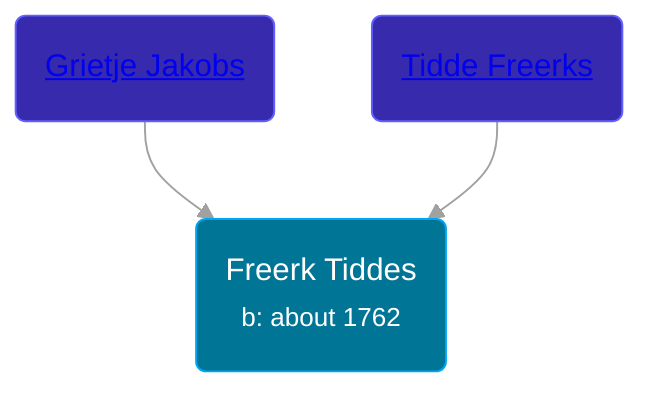

## 🔵 Freerk Tiddes
<small>Age: 69y, 2m, 18d</small>

Son of [Tidde Freerks](/people/3/35267914) and [Grietje Jakobs](/people/4/42339241)





### 📆 Events


Type | Date | Age at Event | Place
------ | ------ | ------ | ------
Birth | about 1762 |  | Groningen, Netherlands
[Death](#event-event-3) | 18 FEB 1831 | 69y, 2m, 18d | Loppersum, Netherlands



- **Birth**
**Date**: about 1762, Age:
**Place**: Groningen, Netherlands
- **[Death](#event-event-3)**
**Date**: 18 FEB 1831, Age: 69y, 2m, 18d
**Place**: Loppersum, Netherlands


## 👩‍❤️‍👨 Relationships

### 🟣 [Ida Egberts](/people/6/68075578), b. abt 1765

#### Events


Type | Date | Age at Event | Place
------ | ------ | ------ | ------
[Marriage](#event-family-0-event-0) | 25 APR 1789 | 27y, 4m, 25d | Loppersum, Netherlands



- **[Marriage](#event-family-0-event-0)**
**Date**: 25 APR 1789, Age: 27y, 4m, 25d
**Place**: Loppersum, Netherlands


#### Children With Ida Egberts
* 🔵 [Living Person](/people/5/57899032)
* 🟣 [Grietje Tiddes Olthof](/people/5/57641632), b. abt 1787
* 🔵 [Tidde Freerks Olthof](/people/7/7481187), b. 29 AUG 1790
* 🔵 [Jakob Freerks Tiddes](/people/1/17712576), b. abt 1794
* 🟣 [Trijnje Freerks Olthof](/people/5/5004158), b. abt 1799
### 📰 Event Sources

####  Marriage, 25 APR 1789
* Dutch Civil Register
>   
  > Groom: Freerk Tiddes  
  > diversen: geboren te Groningen, van Loppersum  
  >   
  > Bride: Ida Egberts  
  > diversen: geboren te Garsthuizen, van Westeremden  
  >   
  > Event: Trouwen  
  > Event date: 25-04-1789  
  > Event place: Kerkelijke gemeente Loppersum  
  >   
  > Document type: DTB Trouwen  
  > Heritage institution: Groninger Archieven  
  > Institution place: Groningen  
  > Collection region: Groningen  
  > Archive: 124  
  > Registration number: 264  
  > Page: 205  
  > Registration date: 25-04-1789  
  > Document place: Loppersum  
  > Collection: Archiefnaam: Doop-, trouw- en begraafboeken enz. in de provincie Groningen, Bron: boek, Deel: 264...  
  > Book: Doop- en trouwboek 1634-1801  
  > AkteSoort: registratie  
  >

####  Death, 18 FEB 1831
* Dutch Civil Register
>   
  > Deceased: Freerk Tiddes Olthof  
  > Profession: dagloner (day laborer)  
  > Place of birth: Loppersum  
  > Gender: Man  
  > Age: 69 jaar  
  >   
  > Father: Tidde Freerks  
  > Profession (Father): dagloner (day laborer)  
  >   
  > Mother: Grietje Jakobs  
  > Profession (Mother): daglonersche (day laborer)  
  >   
  > Relation: Ida Egberts  
  >   
  > Event: Overlijden (death)  
  > Event date: 18-02-1831  
  > Event place: Loppersum  
  >   
  > Document type: BS Overlijden  
  > Heritage institution: Groninger Archieven  
  > Institution place: Groningen  
  > Collection region: Groningen  
  > Sourcenumber: 5  
  > Registration date: 21-02-1831  
  > Document place: Loppersum  
  > Collection: Bron: boek, Periode: 1831  
  > Book: Overlijdensregister 1831  
  >