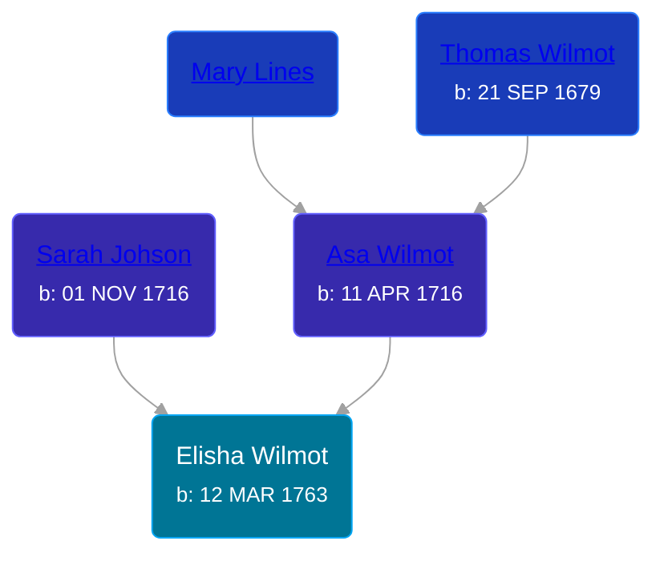

## 🔵 Elisha Wilmot
<small>Age: 49y, 8m, 18d</small>

Son of [Asa Wilmot](/people/1/15735504) and [Sarah Johson](/people/4/48968878)





### 📆 Events


Type | Date | Age at Event | Place
------ | ------ | ------ | ------
[Birth](#event-event-2) | 12 MAR 1763 |  | Cheshire, New Haven, Connecticut
Death | abt 1813 | 49y, 8m, 18d | New Haven, Connecticut, USA



- **[Birth](#event-event-2)**
**Date**: 12 MAR 1763, Age:
**Place**: Cheshire, New Haven, Connecticut
- **Death**
**Date**: abt 1813, Age: 49y, 8m, 18d
**Place**: New Haven, Connecticut, USA


## 👩‍❤️‍👨 Relationships

### 🟣 [Hannah Gladding](/people/8/88055086), b. 16 NOV 1762

#### Events


Type | Date | Age at Event | Place
------ | ------ | ------ | ------
[Marriage](#event-family-0-event-0) | 03 JAN 1785 | 21y, 9m, 21d | Cheshire, New Haven, Connecticut



- **[Marriage](#event-family-0-event-0)**
**Date**: 03 JAN 1785, Age: 21y, 9m, 21d
**Place**: Cheshire, New Haven, Connecticut


#### Children With Hannah Gladding
* 🟣 [Living Person](/people/9/98438457)
* 🟣 [Living Person](/people/6/62537801)
* 🔵 [Living Person](/people/8/85964764)
* 🔵 [Living Person](/people/1/14986330)
* 🟣 [Living Person](/people/7/70258360)
* 🔵 [Living Person](/people/2/2148356)
* 🟣 [Electa Wilmot](/people/7/77370498), b. 15 FEB 1776
* 🔵 [Silas Wilmot](/people/4/49979698), b. 19 OCT 1790
* 🔵 [Elisha Johnson Wilmot](/people/5/57693706), b. 1793
### 📰 Event Sources

####  Birth, 12 MAR 1763
* The New England Historical and Genealogical Register  - 73

####  Marriage, 03 JAN 1785
* The New England Historical and Genealogical Register  - 73
* Genealogy: A Journal of American Ancestry  - 29