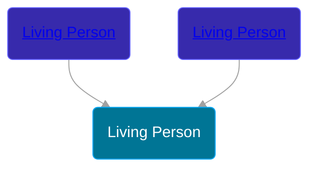

## 🔵 Living Person

Son of [Living Person](/people/2/28832046) and [Living Person](/people/2/27090454)





## 👩‍❤️‍👨 Relationships

### 🟣 [Living Person](/people/7/72063628)

#### Children With Living Person
* 🔵 [Living Person](/people/7/72212700)
* 🟣 [Living Person](/people/4/45456538)
* 🔵 [Living Person](/people/1/16620202)