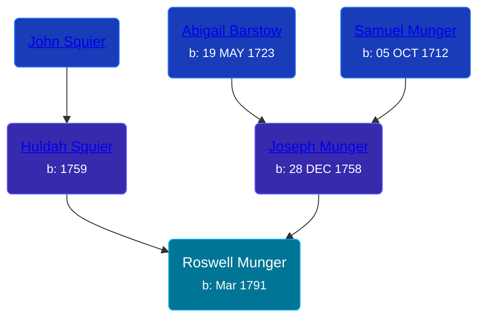

## 🔵 Roswell Munger
<small>Age: 61y, 1m, 16d</small>

Son of [Joseph Munger](/people/4/48832802) and [Huldah Squier](/people/4/40449307)





### 📆 Events


Type | Date | Age at Event | Place
------ | ------ | ------ | ------
[Birth](#event-event-2) | Mar 1791 |  | Monson, Massachusetts, USA
[Residence](#event-event-0) | 1840 | 48y, 9m | LaGrange, Lorain, Ohio, USA
[Residence](#event-event-1) | 1850 | 58y, 9m | LaGrange, Lorain, Ohio, USA
[Death](#event-event-5) | 16 APR 1852 | 61y, 1m, 16d | Wales, Massachusetts, USA
[Burial](#event-event-6) |  |  | LaGrange Cemetery, LaGrange, Lorain, Ohio, USA



- **[Birth](#event-event-2)**
**Date**: Mar 1791, Age:
**Place**: Monson, Massachusetts, USA
- **[Residence](#event-event-0)**
**Date**: 1840, Age: 48y, 9m
**Place**: LaGrange, Lorain, Ohio, USA
- **[Residence](#event-event-1)**
**Date**: 1850, Age: 58y, 9m
**Place**: LaGrange, Lorain, Ohio, USA
- **[Death](#event-event-5)**
**Date**: 16 APR 1852, Age: 61y, 1m, 16d
**Place**: Wales, Massachusetts, USA
- **[Burial](#event-event-6)**
**Date**:
**Place**: LaGrange Cemetery, LaGrange, Lorain, Ohio, USA


## 👩‍❤️‍👨 Relationships

### 🟣 [Ann Berthena ](/people/9/91501676), b. abt 1810

#### Children With Ann Berthena
* 🟣 [Almira Munger](/people/3/36419408), b. 25 SEP 1827
* 🔵 [Joseph Munger](/people/8/88850948), b. abt 1832
* 🟣 [Marinda Munger](/people/4/42602883), b. 28 AUG 1837
* 🔵 [William Munger](/people/8/84347792), b. ABT 1840
### 📰 Event Sources

####  Birth, Mar 1791
* The Munger Book  - 263
* Massachusetts, Town and Vital Records, 1620-1988  - 274

####  Residence, 1840
* 1840 US Census

####  Residence, 1850
* 1850 US Census

####  Death, 16 APR 1852
* Massachusetts, Town and Vital Records, 1620-1988
>   
  > NAME:Roswell Munger  
  > EVENT TYPE: Death  
  > BIRTH DATE: Mar 1791  
  > DEATH DATE: 16 Apr 1852  
  > DEATH PLACE: Wales, Massachusetts  
  > DEATH AGE: 61  
  > FATHER NAME: Joseph Munger  
  > MOTHER NAME: Huldah Squier

####  Burial
* findagrave.com