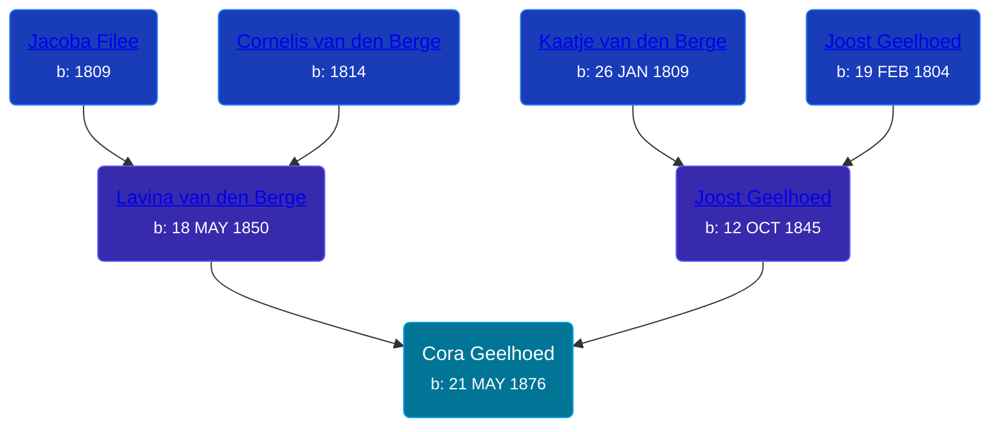

## 🟣 Cora Geelhoed
<small>Age: 62y, 5m, 27d</small>

Daughter of [Joost Geelhoed](/people/7/73673934) and [Lavina van den Berge](/people/7/71558365)





### 📆 Events


Type | Date | Age at Event | Place
------ | ------ | ------ | ------
[Birth](#event-event-2) | 21 MAY 1876 |  | Dreischor, Zeeland, Netherlands
[Death](#event-event-3) | 18 NOV 1938 | 62y, 5m, 27d | Grand Rapids, Kent, Michigan, United States
Burial | 21 NOV 1938 | 62y, 6m | Cascade Cemetery, Cascade, Kent, Michigan, USA



- **[Birth](#event-event-2)**
**Date**: 21 MAY 1876, Age:
**Place**: Dreischor, Zeeland, Netherlands
- **[Death](#event-event-3)**
**Date**: 18 NOV 1938, Age: 62y, 5m, 27d
**Place**: Grand Rapids, Kent, Michigan, United States
- **Burial**
**Date**: 21 NOV 1938, Age: 62y, 6m
**Place**: Cascade Cemetery, Cascade, Kent, Michigan, USA


### 📰 Event Sources

####  Birth, 21 MAY 1876
* Geelhoet, Geelhoed & Geelhoedt Genealogie

####  Death, 18 NOV 1938
* Michigan, Death Records, 1867-1950
>   
  > Name: Mrs Cora Den Houten  
  > Gender: Female  
  > Marital Status: Married  
  > Birth Date: 21 May 1876  
  > Birth Place: Netherlands  
  > Death Date: 18 Nov 1938  
  > Death Place: Grand Rapids, Kent, Michigan, USA  
  > Death Age: 62  
  > Father: Joseph Geelhoed  
  > Birthplace: Netherlands  
  > Mother: Lavina VandenBerg  
  > Birthplace: Netherlands  
  > Informant: William DenHouten  
  > Burial: Cascade Cemetery  
  > Date: 11/21/38  
  > File Number: 029785
