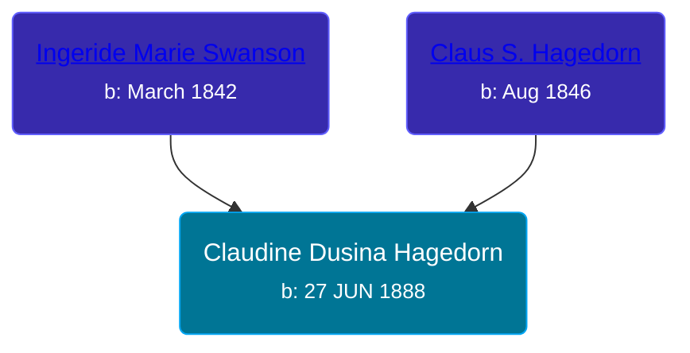

## 🟣 Claudine Dusina Hagedorn

Daughter of [Claus S. Hagedorn](/people/8/89695136) and [Ingeride Marie Swanson](/people/4/41786466)





### 📆 Events


Type | Date | Age at Event | Place
------ | ------ | ------ | ------
[Birth](#event-event-3) | 27 JUN 1888 |  | Germany
[Residence](#event-event-0) | 12 JUN 1900 | 11y, 11m, 15d | Peterson Township, Clay, Iowa, USA
[Immigration](#event-event-1) | 1900 | 11y, 5m, 3d |
[Confirmation](#event-event-2) | 22 APR 1906 | 17y, 9m, 25d | Peterson Township, Clay, Iowa, USA
[Naturalization](#event-event-3) | 1907 | 18y, 5m, 3d |
[Residence](#event-event-4) | 15 APR 1910 | 21y, 9m, 18d | Douglas, Clay, Iowa, USA
[Residence](#event-event-5) | 14 FEB 1920 | 31y, 7m, 17d | Riverton Township, Clay, Iowa, USA
[Residence](#event-event-6) | 01 JAN 1925 | 36y, 6m, 4d | Lincoln, Clay, Iowa, USA
[Residence](#event-event-7) | 09 APR 1930 | 41y, 9m, 12d | Royal Town, Clay, Iowa, USA



- **[Birth](#event-event-3)**
**Date**: 27 JUN 1888, Age:
**Place**: Germany
- **[Residence](#event-event-0)**
**Date**: 12 JUN 1900, Age: 11y, 11m, 15d
**Place**: Peterson Township, Clay, Iowa, USA
- **[Immigration](#event-event-1)**
**Date**: 1900, Age: 11y, 5m, 3d
**Place**:
- **[Confirmation](#event-event-2)**
**Date**: 22 APR 1906, Age: 17y, 9m, 25d
**Place**: Peterson Township, Clay, Iowa, USA
- **[Naturalization](#event-event-3)**
**Date**: 1907, Age: 18y, 5m, 3d
**Place**:
- **[Residence](#event-event-4)**
**Date**: 15 APR 1910, Age: 21y, 9m, 18d
**Place**: Douglas, Clay, Iowa, USA
- **[Residence](#event-event-5)**
**Date**: 14 FEB 1920, Age: 31y, 7m, 17d
**Place**: Riverton Township, Clay, Iowa, USA
- **[Residence](#event-event-6)**
**Date**: 01 JAN 1925, Age: 36y, 6m, 4d
**Place**: Lincoln, Clay, Iowa, USA
- **[Residence](#event-event-7)**
**Date**: 09 APR 1930, Age: 41y, 9m, 12d
**Place**: Royal Town, Clay, Iowa, USA


## 👩‍❤️‍👨 Relationships

### 🔵 [Henry George Suggitt](/people/7/7271894), b. 11 SEP 1888

#### Events


Type | Date | Age at Event | Place
------ | ------ | ------ | ------
[Marriage](#event-family-0-event-0) | 05 JUN 1912 | 23y, 11m, 8d | Royal Town, Clay, Iowa, USA



- **[Marriage](#event-family-0-event-0)**
**Date**: 05 JUN 1912, Age: 23y, 11m, 8d
**Place**: Royal Town, Clay, Iowa, USA


#### Children With Henry George Suggitt
* 🟣 [Living Person](/people/4/4805871)
* 🟣 [Vivian Mildred Suggitt](/people/9/90213536), b. 10 OCT 1917
* 🟣 [Doris M. Suggitt](/people/6/62856138), b. 22 JAN 1920
* 🔵 [Arley Duane Suggitt](/people/9/91694885), b. 01 JUN 1929
### 📰 Event Sources

####  Birth, 27 JUN 1888
* U.S., Evangelical Lutheran Church of America, Records, 1875-1940

####  Immigration, 1900
* 1920 US Census

####  Residence, 12 JUN 1900
* 1900 US Census

####  Confirmation, 22 APR 1906
* U.S., Evangelical Lutheran Church of America, Records, 1875-1940

####  Naturalization, 1907
* 1920 US Census

####  Residence, 15 APR 1910
* 1910 US Census

####  Marriage, 05 JUN 1912
* U.S., Evangelical Lutheran Church of America, Records, 1875-1940
* Iowa, Marriage Records, 1880-1937
>   
  > No. of License: 3432  
  > Witness: Walter Suggitt  
  > Groom: George Suggitt  
  > Age next Birthday: 24  
  > Color: White  
  > Born: Neponsit Ill.  
  > Bride: Claudine Hagedorn  
  > Bride Age next Birthday: 23  
  > Birthplace: Germany  
  > Place married: Royal Iowa  
  > Married: June 5, 1912

####  Residence, 14 FEB 1920
* 1920 US Census

####  Residence, 01 JAN 1925
* 1925 Iowa State Census
####  Residence, 09 APR 1930
* 1930 US Census
