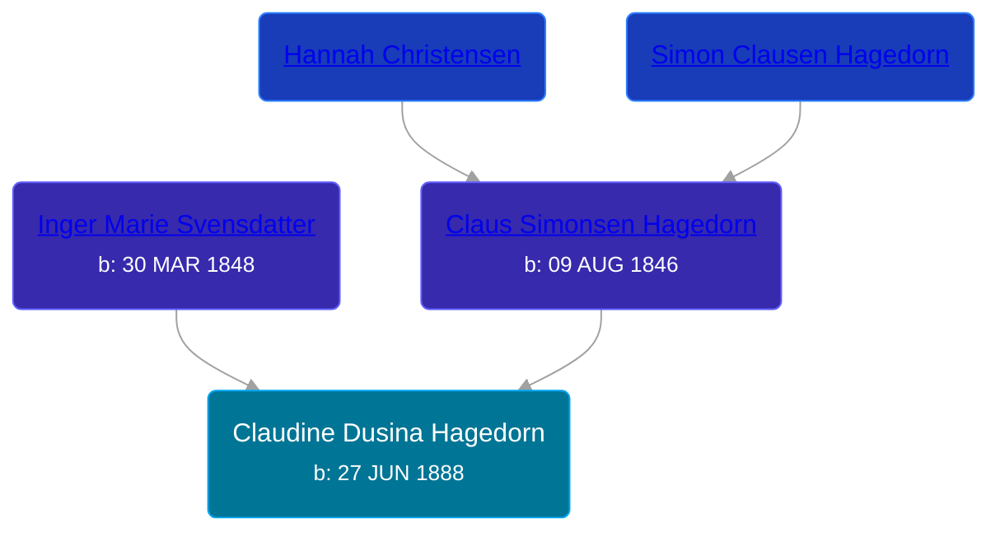

## 🟣 Claudine Dusina Hagedorn
<small>Age: 78y, 8m, 6d</small>

Daughter of [Claus Simonsen Hagedorn](/people/8/89695136) and [Inger Marie Svensdatter](/people/4/41786466)



```mermaid
graph
classDef grands fill:#193cb8,stroke:#2b7fff,stroke-width:1px,color:#fff;
classDef parents fill:#372aac,stroke:#615fff,stroke-width:1px,color:#fff;
classDef primary fill:#007595,stroke:#00a6f4,stroke-width:1px,color:#fff;
21896640(Claudine Dusina Hagedorn<br /><small>b: 27 JUN 1888</small>):::primary
41786466(<a class="text-white" href="/people/4/41786466">Inger Marie Svensdatter</a><br /><small>b: 30 MAR 1848</small>):::parents-->21896640
89695136(<a class="text-white" href="/people/8/89695136">Claus Simonsen Hagedorn</a><br /><small>b: 09 AUG 1846</small>):::parents-->21896640
1113854(<a class="text-white" href="/people/1/1113854">Hannah Christensen</a>):::grands-->89695136
50450582(<a class="text-white" href="/people/5/50450582">Simon Clausen Hagedorn</a>):::grands-->89695136
linkStyle default stroke:#a1a1a1
```


### 📆 Events


Type | Date | Age at Event | Place
------ | ------ | ------ | ------
[Birth](#event-event-0) | 27 JUN 1888 |  | Denmark
[Baptism](#event-event-1) | 23 JUL 1889 | 1y, 26d | Haderslev Amt, Denmark
[Residence](#event-event-2) | 12 JUN 1900 | 11y, 11m, 15d | Peterson Township, Clay, Iowa, USA
[Immigration](#event-event-3) | 1900 | 11y, 5m, 3d |
[Confirmation](#event-event-4) | 22 APR 1906 | 17y, 9m, 25d | Peterson Township, Clay, Iowa, USA
[Naturalization](#event-event-5) | 1907 | 18y, 5m, 3d |
[Residence](#event-event-6) | 15 APR 1910 | 21y, 9m, 18d | Douglas, Clay, Iowa, USA
[Residence](#event-event-7) | 14 FEB 1920 | 31y, 7m, 17d | Riverton Township, Clay, Iowa, USA
[Residence](#event-event-8) | 01 JAN 1925 | 36y, 6m, 4d | Lincoln, Clay, Iowa, USA
[Residence](#event-event-9) | 09 APR 1930 | 41y, 9m, 12d | Royal Town, Clay, Iowa, USA
[Residence](#event-event-10) | 04 APR 1950 | 61y, 9m, 7d | Sioux City, Woodbury, Iowa, USA
[Death](#event-event-11) | 03 MAR 1967 | 78y, 8m, 6d | Sioux City, Woodbury, Iowa, USA
[Burial](#event-event-12) | 06 MAR 1967 | 78y, 8m, 9d | Memorial Park Cemetery, Sioux City, Woodbury, Iowa, USA



- **[Birth](#event-event-0)**
**Date**: 27 JUN 1888, Age:
**Place**: Denmark
- **[Baptism](#event-event-1)**
**Date**: 23 JUL 1889, Age: 1y, 26d
**Place**: Haderslev Amt, Denmark
- **[Residence](#event-event-2)**
**Date**: 12 JUN 1900, Age: 11y, 11m, 15d
**Place**: Peterson Township, Clay, Iowa, USA
- **[Immigration](#event-event-3)**
**Date**: 1900, Age: 11y, 5m, 3d
**Place**:
- **[Confirmation](#event-event-4)**
**Date**: 22 APR 1906, Age: 17y, 9m, 25d
**Place**: Peterson Township, Clay, Iowa, USA
- **[Naturalization](#event-event-5)**
**Date**: 1907, Age: 18y, 5m, 3d
**Place**:
- **[Residence](#event-event-6)**
**Date**: 15 APR 1910, Age: 21y, 9m, 18d
**Place**: Douglas, Clay, Iowa, USA
- **[Residence](#event-event-7)**
**Date**: 14 FEB 1920, Age: 31y, 7m, 17d
**Place**: Riverton Township, Clay, Iowa, USA
- **[Residence](#event-event-8)**
**Date**: 01 JAN 1925, Age: 36y, 6m, 4d
**Place**: Lincoln, Clay, Iowa, USA
- **[Residence](#event-event-9)**
**Date**: 09 APR 1930, Age: 41y, 9m, 12d
**Place**: Royal Town, Clay, Iowa, USA
- **[Residence](#event-event-10)**
**Date**: 04 APR 1950, Age: 61y, 9m, 7d
**Place**: Sioux City, Woodbury, Iowa, USA
- **[Death](#event-event-11)**
**Date**: 03 MAR 1967, Age: 78y, 8m, 6d
**Place**: Sioux City, Woodbury, Iowa, USA
- **[Burial](#event-event-12)**
**Date**: 06 MAR 1967, Age: 78y, 8m, 9d
**Place**: Memorial Park Cemetery, Sioux City, Woodbury, Iowa, USA


## 👩‍❤️‍👨 Relationships

### 🔵 [Henry George Suggitt](/people/7/7271894), b. 11 SEP 1888

#### Events


Type | Date | Age at Event | Place
------ | ------ | ------ | ------
[Marriage](#event-family-0-event-0) | 05 JUN 1912 | 23y, 11m, 8d | Royal Town, Clay, Iowa, USA



- **[Marriage](#event-family-0-event-0)**
**Date**: 05 JUN 1912, Age: 23y, 11m, 8d
**Place**: Royal Town, Clay, Iowa, USA


#### Children With Henry George Suggitt
* 🟣 [Living Person](/people/4/4805871)
* 🟣 [Vivian Mildred Suggitt](/people/9/90213536), b. 10 OCT 1917
* 🟣 [Doris M. Suggitt](/people/6/62856138), b. 22 JAN 1920
* 🔵 [Arley Duane Suggitt](/people/9/91694885), b. 01 JUN 1929
### 📰 Event Sources

####  Birth, 27 JUN 1888
* U.S., Evangelical Lutheran Church of America, Records, 1875-1940

####  Baptism, 23 JUL 1889
* Denmark, Church Records, 1812-1924
>
  > Name: Claudine Sine Hagedorn
  > Birth: 27 Jun
  > Baptism: 23 July 1889 Haderslev Amt, Haderslev Amt, Danmark
  > Father: Klaus Simonsen Hagedorn
  > Mother: Ingrid Maria Svensen Svensen
  >

####  Immigration, 1900
* 1920 US Census

####  Residence, 12 JUN 1900
* 1900 US Census

####  Confirmation, 22 APR 1906
* U.S., Evangelical Lutheran Church of America, Records, 1875-1940

####  Naturalization, 1907
* 1920 US Census

####  Residence, 15 APR 1910
* 1910 US Census

####  Marriage, 05 JUN 1912
* Iowa, Marriage Records, 1880-1937
>
  > No. of License: 3432
  > Witness: Walter Suggitt
  > Groom: George Suggitt
  > Age next Birthday: 24
  > Color: White
  > Born: Neponsit Ill.
  > Bride: Claudine Hagedorn
  > Bride Age next Birthday: 23
  > Birthplace: Germany
  > Place married: Royal Iowa
  > Married: June 5, 1912
* U.S., Evangelical Lutheran Church of America, Records, 1875-1940

####  Residence, 14 FEB 1920
* 1920 US Census

####  Residence, 01 JAN 1925
* 1925 Iowa State Census

####  Residence, 09 APR 1930
* 1930 US Census

####  Residence, 04 APR 1950
* 1950 US Census
>
  > Name: Claudien Suggitt
  > Age: 60
  > Birth Date: abt 1890
  > Gender: Female
  > Race: White
  > Birth Place: Germany
  > Marital Status: Married
  > Relation to Head of House: Wife
  > Residence Date: 1950
  > Home in 1950: Sioux City, Woodbury, Iowa, USA
  > Street Name: Jennings
  > House Number: 1305
  > Dwelling Number: 88
  > Farm: No
  > Acres: No
  > Citizenship: Yes
  > Occupation Category: Keeping House
  > Worked Last Week: No
  > Seeking Work: No
  > Employment Status: No
  >
  > Household members:
  > - George Suggitt, 61, Head
  > - Claudien Suggitt, 60, Wife
  > - Arley Suggitt, 20, Son
  >

####  Death, 03 MAR 1967
* Iowa, U.S., Death Records, 1880-1968
>
  > Name: Claudine Dusina Suggitt
  > Gender: Female
  > Race: White
  > Age: 77
  > Birth Date: 27 Jun 1889
  > Death Date: 3 Mar 1967
  > Death Place: Sioux City, Woodbury, Iowa, USA
  > Burial Date: 6 Mar 1967
  > Burial Place: Sioux City, Iowa
  > Father: Claus Hegedorn
  > Mother: Marie Swanson
  > Certificate Number: 67-06991
  > Notes: Y
  >
####  Burial, 06 MAR 1967
* findagrave.com
>
  > Suggitt, Claudine N.
  > b: June 27, 1889
  > d: March 3, 1967

