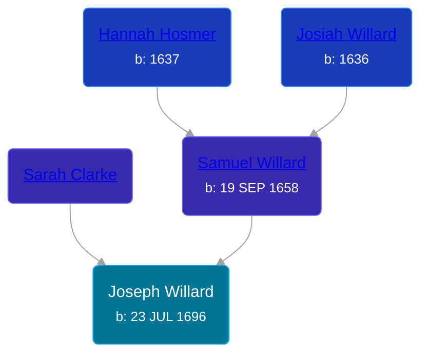

## 🔵 Joseph Willard
<small>Age: 27y, 1m</small>

Son of [Samuel Willard](/people/5/55389376) and [Sarah Clarke](/people/9/93595493)





### 📆 Events


Type | Date | Age at Event | Place
------ | ------ | ------ | ------
[Birth](#event-event-2) | 23 JUL 1696 |  | Saybrook, Middlesex, Connecticut, USA
[Death](#event-event-3) | 23 AUG 1723 | 27y, 1m |



- **[Birth](#event-event-2)**
**Date**: 23 JUL 1696, Age:
**Place**: Saybrook, Middlesex, Connecticut, USA
- **[Death](#event-event-3)**
**Date**: 23 AUG 1723, Age: 27y, 1m
**Place**:


## 👩‍❤️‍👨 Relationships

### 🟣 [Susanna Lynde](/people/5/55939954), b. 11 APR 1700

#### Events


Type | Date | Age at Event | Place
------ | ------ | ------ | ------
[Marriage](#event-family-0-event-0) | Aug 1718 | 22y, 7d |



- **[Marriage](#event-family-0-event-0)**
**Date**: Aug 1718, Age: 22y, 7d
**Place**:


### 📰 Event Sources

####  Birth, 23 JUL 1696
* Biographical Sketches of the Graduates of Yale College  - 139

####  Marriage, Aug 1718
* Biographical Sketches of the Graduates of Yale College  - 139
####  Death, 23 AUG 1723
* Willard Memoir: Sketch of the Life of Maj. Simon Willard  - 8
* Biographical Sketches of the Graduates of Yale College  - 139
