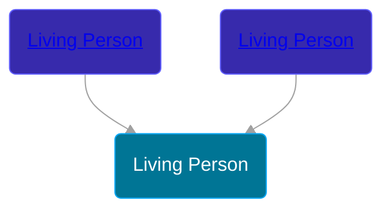

## 🟣 Living Person

Daughter of [Living Person](/people/1/14375808) and [Living Person](/people/3/37928171)





## 👩‍❤️‍👨 Relationships

### 🔵 [Living Person](/people/6/66828208)

#### Children With Living Person
* 🔵 [Richard Haines](/people/2/25122588)