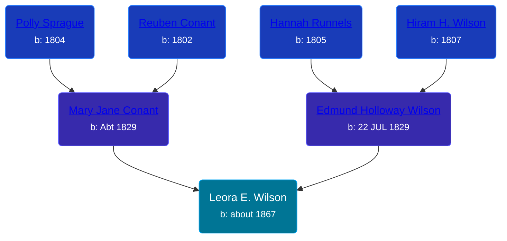

## 🟣 Leora E. Wilson
<small>Age: 3y, 4m, 27d</small>

Daughter of [Edmund Holloway Wilson](/people/6/67777324) and [Mary Jane Conant](/people/2/27722232)





### 📆 Events


Type | Date | Age at Event | Place
------ | ------ | ------ | ------
Birth | about 1867 |  | New York, USA
[Death](#event-event-3) | 27 APR 1870 | 3y, 4m, 27d | Allendale, Ottawa, Michigan, USA



- **Birth**
**Date**: about 1867, Age:
**Place**: New York, USA
- **[Death](#event-event-3)**
**Date**: 27 APR 1870, Age: 3y, 4m, 27d
**Place**: Allendale, Ottawa, Michigan, USA


### 📰 Event Sources

####  Death, 27 APR 1870
* Michigan, Deaths and Burials Index, 1867-1995
>   
  > Name: Leora E. Wilson  
  > Birth Date: abt 1867  
  > Birth Place: New York  
  > Death Date: 27 Apr 1870  
  > Death Place: Allendale, Ottawa, Mich.  
  > Death Age: 3  
  > Race: White  
  > Marital Status: Single  
  > Gender: Female  
  > Father Name: Edmond Wilson  
  > Mother Name: Mary J. Wilson  
  > FHL Film Number: 984237
* Michigan, Death Records, 1867-1950
>   
  > Name:Leora E Wilson  
  > Gender:Female  
  > Marital Status:Single  
  > Birth Date:1868  
  > Birth Place:New York  
  > Death Date:27 Apr 1870  
  > Death Place:Allendale, Ottawa, Michigan, USA  
  > Death Age:2  
  > File Number:8  
  > Father:Edmund Wilson  
  > Mother:Mary J Wilson
* U.S. Federal Census Mortality Schedules, 1850-1885
>   
  > Name: Leora E Wilson  
  > Gender: Female  
  > Race: White  
  > Estimated birth year: abt 1866  
  > Birth Place: New York, USA  
  > Age: 4  
  > Death Date: Apr 1870  
  > Cause of Death: Scarlet Fever  
  > Census Year: 1870  
  > Census Place: Allendale, Ottawa, Michigan  
  > LINE: 2
