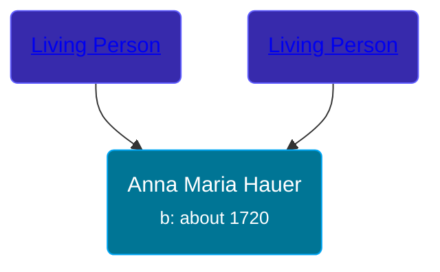

## 🟣 Anna Maria Hauer

Daughter of [Living Person](/people/2/22920858) and [Living Person](/people/4/46044031)





### 📆 Events


Type | Date | Age at Event | Place
------ | ------ | ------ | ------
[Birth](#event-event-3) | about 1720 |  |
[Immigration](#event-event-0) | 31 OCT 1737 | 17y, 10m, 31d |



- **[Birth](#event-event-3)**
**Date**: about 1720, Age:
**Place**:
- **[Immigration](#event-event-0)**
**Date**: 31 OCT 1737, Age: 17y, 10m, 31d
**Place**:


## 👩‍❤️‍👨 Relationships

### 🔵 [Living Person](/people/1/13545057)

#### Children With Living Person
* 🟣 [Catherine Dunkelberger](/people/1/19744824), b. about 1740
* 🟣 [Anna Maria Dunkelberger](/people/2/28076308), b. about 1742
* 🔵 [Johannes Jacob Dunkelberger](/people/3/3659869), b. 08 OCT 1744
* 🔵 [Frederick Dunkelberger](/people/2/29307544), b. 24 APR 1747
* 🔵 [Christopher Dunkelberger](/people/8/88832375), b. about 1749
* 🟣 [Maria Elizabeth Dunkelberger](/people/6/68027592), b. about 1749
* 🔵 [Philip Dunkelberger](/people/6/68247643), b. about 1750
* 🔵 [Clement Dunkelberger](/people/7/75287884), b. about 1752
* 🟣 [Sevilla Dunkelberger](/people/4/44893832), b. about 1754
* 🟣 [Magdalena Dunkelberger](/people/5/57016064), b. about 1756
* 🟣 [Dorthea Dunkelberger](/people/5/56682191), b. about 1758
### 📰 Event Sources

####  Birth, about 1720
* The Dunkelberger Family: Europe to America, 1600-1982

####  Immigration, 31 OCT 1737
* The Dunkelberger Family: Europe to America, 1600-1982