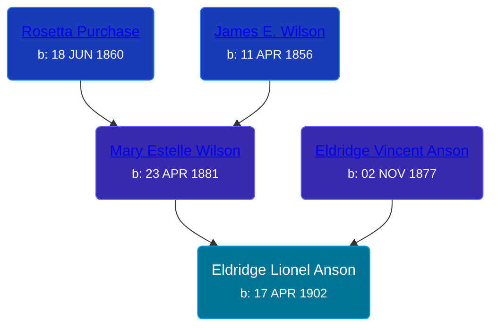

## 🔵 Eldridge Lionel Anson
<small>Age: 73y, 1m, 22d</small>

Son of [Eldridge Vincent Anson](/people/2/29601540) and [Mary Estelle Wilson](/people/4/46787428)





### 📆 Events


Type | Date | Age at Event | Place
------ | ------ | ------ | ------
Birth | 17 APR 1902 |  |
[Death](#event-event-3) | 09 JUN 1975 | 73y, 1m, 22d | Grand Rapids, Kent, Michigan, United States



- **Birth**
**Date**: 17 APR 1902, Age:
**Place**:
- **[Death](#event-event-3)**
**Date**: 09 JUN 1975, Age: 73y, 1m, 22d
**Place**: Grand Rapids, Kent, Michigan, United States


### 📰 Event Sources

####  Death, 09 JUN 1975
* The Grand Rapids Press
>   
  > ANSON (MUSKEGON) -- Eldridge L. Anson, aged 73 of 1100 Kampenga, passed away Monday morning at Ferguson-Droste-Ferguson Hospital following a lingering illness. Mr. Anson worked as a welder at Lakey Foundry in Muskegon until his retirement. He is survived by one brother, Hildreth of White Cloud; two half-brothers, James Whiting of Rockford and Vernon Whiting of Muskegon; several nieces and nephews. Funeral services will be held Thursday 1:30 pm at the Hessel-Cheslek Funeral Home with Rev. Donald Johnson officiating. Interment Alpine Cemetery.
* U.S., Social Security Death Index, 1935-2014
>   
  > Name: ELDRIDGE ANSON  
  > Birth: 17 Apr 1902  
  > Death: Jun 1975  
  > Last Residence: 49440 (Muskegon, Muskegon, MI)  
  > Last Benefit: (none specified)  
  > SSN: ###-##-####  
  > Issued: Michigan
