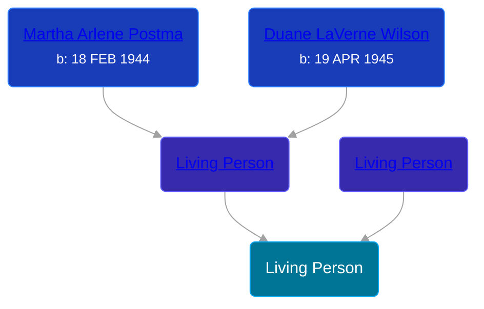

## 🔵 Living Person

Son of [Living Person](/people/6/63426026) and [Living Person](/people/4/46067436)



```mermaid
graph
classDef grands fill:#193cb8,stroke:#2b7fff,stroke-width:1px,color:#fff;
classDef parents fill:#372aac,stroke:#615fff,stroke-width:1px,color:#fff;
classDef primary fill:#007595,stroke:#00a6f4,stroke-width:1px,color:#fff;
23105768(Living Person):::primary
46067436(<a class="text-white" href="/people/4/46067436">Living Person</a>):::parents-->23105768
39368292(<a class="text-white" href="/people/3/39368292">Martha Arlene Postma</a><br /><small>b: 18 FEB 1944</small>):::grands-->46067436
61086158(<a class="text-white" href="/people/6/61086158">Duane LaVerne Wilson</a><br /><small>b: 19 APR 1945</small>):::grands-->46067436
63426026(<a class="text-white" href="/people/6/63426026">Living Person</a>):::parents-->23105768
linkStyle default stroke:#a1a1a1
```

