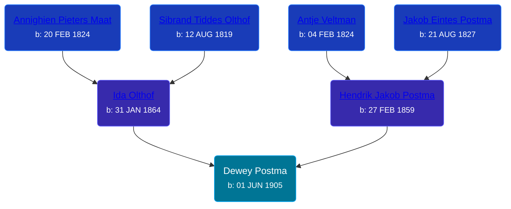

## 🔵 Dewey Postma
<small>Age: 33y, 7m, 5d</small>

Son of [Hendrik Jakob Postma](/people/3/31727152) and [Ida Olthof](/people/6/60020862)





### 📆 Events


Type | Date | Age at Event | Place
------ | ------ | ------ | ------
[Birth](#event-event-2) | 01 JUN 1905 |  | Gaines Township, Kent, Michigan, USA
[Residence](#event-event-0) | 1910 | 4y, 5m, 29d | Gaines Township, Kent, Michigan, USA
[Residence](#event-event-1) | 1920 | 14y, 5m, 29d | Gaines Township, Kent, Michigan, USA
[Residence](#event-event-2) | 24 APR 1930 | 24y, 10m, 23d | Gaines Township, Kent, Michigan, USA
[Death](#event-event-6) | 06 JAN 1939 | 33y, 7m, 5d | East Grand Rapids, Kent, Michigan, USA



- **[Birth](#event-event-2)**
**Date**: 01 JUN 1905, Age:
**Place**: Gaines Township, Kent, Michigan, USA
- **[Residence](#event-event-0)**
**Date**: 1910, Age: 4y, 5m, 29d
**Place**: Gaines Township, Kent, Michigan, USA
- **[Residence](#event-event-1)**
**Date**: 1920, Age: 14y, 5m, 29d
**Place**: Gaines Township, Kent, Michigan, USA
- **[Residence](#event-event-2)**
**Date**: 24 APR 1930, Age: 24y, 10m, 23d
**Place**: Gaines Township, Kent, Michigan, USA
- **[Death](#event-event-6)**
**Date**: 06 JAN 1939, Age: 33y, 7m, 5d
**Place**: East Grand Rapids, Kent, Michigan, USA


### 📰 Event Sources

####  Birth, 01 JUN 1905
* Michigan, U.S., Birth Records, 1867-1914
>   
  > Name: Dewey Postema  
  > Gender: Male  
  > Race: White  
  > Birth Date: 1 Jun 1905  
  > Birth Place: Gaines Township, Michigan, USA  
  > Father: Henry Postema  
  > Mother: Ida Postema  
  > Jurisdiction Number: 3908  
  > Reference Number: 83  
  >

####  Residence, 1910
* 1910 US Census

####  Residence, 1920
* 1920 US Census

####  Residence, 24 APR 1930
* 1930 US Census

####  Death, 06 JAN 1939
* The Grand Rapids Press  - 7 Jan 1939
>   
  > POSTMA -- Dewey Postma, aged 34, of 1153 E-av., S.W., passed away at Blodgett hospital Friday night. Surviving are the widow, Mrs. Cornelia Postma; father, Henry Postma; five brothers, Sybrand, Jacob, Peter, Martin and Charles Postma; two sisters, Mrs. R. Weeber and Mrs. H. Goeman. The body will repose at the home of Mr. and Mrs. John Poll, 78 Kirtland-st., S.W., where private services will be held Tuesday at 1:30, with public service at 2 o'clock at the Burton Heights Christian Reformed church. Arrangements by Van'tHof.
* Michigan, Death Records, 1867-1950
>   
  > Name: Dewey Postma  
  > Gender: Male  
  > Marital Status: Married  
  > Birth Date: Jul 11, 1904  
  > Birth Place: Michigan  
  > Death Date: 6 Jan 1939  
  > Death Place: East Grand Rapids, Kent, Michigan, USA  
  > Death Age: 34  
  > File Number: 001263  
  > Father: Henry Postma  
  > Mother: Ida Olthof