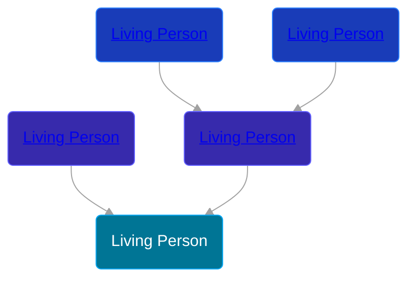

## 🔵 Living Person

Son of [Living Person](/people/1/11913320) and [Living Person](/people/4/44129601)





## 👩‍❤️‍👨 Relationships

### 🟣 [Living Person](/people/8/8527359)

#### Children With Living Person
* 🔵 [Living Person](/people/8/80936130)
* 🟣 [Living Person](/people/8/89706899)