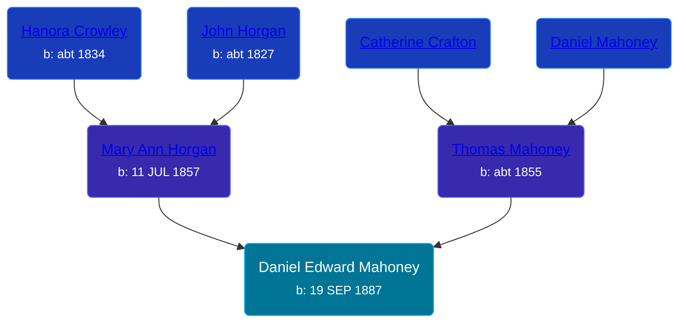

## 🔵 Daniel Edward Mahoney

Son of [Thomas Mahoney](/people/4/41476460) and [Mary Ann Horgan](/people/9/90749846)





### 📆 Events


Type | Date | Age at Event | Place
------ | ------ | ------ | ------
[Birth](#event-event-2) | 19 SEP 1887 |  | St Charles, Saginaw, Michigan, USA
[Residence](#event-event-0) | 11 APR 1950 | 62y, 6m, 22d | Owosso, Shiawassee, Michigan, USA
[Burial](#event-event-4) |  |  | Saint Mary's Cemetery, St Charles, Saginaw, Michigan, USA



- **[Birth](#event-event-2)**
**Date**: 19 SEP 1887, Age:
**Place**: St Charles, Saginaw, Michigan, USA
- **[Residence](#event-event-0)**
**Date**: 11 APR 1950, Age: 62y, 6m, 22d
**Place**: Owosso, Shiawassee, Michigan, USA
- **[Burial](#event-event-4)**
**Date**:
**Place**: Saint Mary's Cemetery, St Charles, Saginaw, Michigan, USA


## 👩‍❤️‍👨 Relationships

### 🟣 [Agnes Greene](/people/1/15565254), b. 14 FEB 1900

#### Events


Type | Date | Age at Event | Place
------ | ------ | ------ | ------
[Marriage](#event-family-0-event-0) | 24 APR 1929 | 41y, 7m, 5d | Owosso, Shiawassee, Michigan, USA



- **[Marriage](#event-family-0-event-0)**
**Date**: 24 APR 1929, Age: 41y, 7m, 5d
**Place**: Owosso, Shiawassee, Michigan, USA


#### Children With Agnes Greene
* 🔵 [Gerald E Mahoney](/people/1/10062624), b. 20 NOV 1930
* 🔵 [Philip J Mahoney](/people/6/64895326), b. 03 JUN 1932
* 🔵 [Thomas Andrew Mahoney](/people/3/30323065), b. abt 1934
### 📰 Event Sources

####  Birth, 19 SEP 1887
* U.S., World War II Draft Registration Cards, 1942
>   
  > Name: Daniel Edward Mahoney  
  > Age:55  
  > Birth Date: 19 Sep 1887  
  > Residence Year: 1942  
  > Residence: Owosso, Michigan, USA
* U.S., World War I Draft Registration Cards, 1917-1918
>   
  > Name: Daniel Edward Mahoney  
  > Race: Caucasian (White)  
  > Marital Status: Single  
  > Birth Date: 19 Sep 1887  
  > Birth Place: Michigan  
  > Street address: R.D #2  
  > Residence Place: Saginaw, Michigan, USA  
  > Physical Build: Slender  
  > Height: Tall  
  > Hair Description: Not Bald  
  > Hair Color: Light Brown  
  > Eye Color: Light Blue

####  Residence, 11 APR 1950
* 1950 US Census
>   
  > Name: D. Edward Mahoney  
  > Age: 62  
  > Birth Date: abt 1888  
  > Gender: Male  
  > Race: White  
  > Birth Place: Michigan  
  > Marital Status: Married  
  > Relation to Head of House: Head  
  > Residence Date: 1950  
  > Home in 1950: Owosso, Shiawassee, Michigan, USA  
  > Street Name: Howell  
  > House Number: 206  
  > Dwelling Number: 192  
  > Occupation: Shipping Department  
  > Industry: Manufacturer Strom Screens  
  > Occupation Category: Working  
  > Hours Worked: 40  
  > Worker Class: Private  
  >   
  > Household members:  
  > D. Edward Mahoney, 62, Head  
  > Agnes Mahoney, 50, Wife  
  > Gerald F Mahoney, 19, Son  
  > Philip J Mahoney, 17, Son  
  > Thomas A Mahoney, 16, Son  
  >

####  Burial
* findagrave.com
####  Marriage, 24 APR 1929
* Michigan, Marriage Records, 1867-1952
>   
  > Name: Agnes Greene  
  > Gender: Female  
  > Race: White  
  > Age: 29  
  > Birth Date: abt 1900  
  > Birth Place: Laingsburg, Michigan  
  > Marriage License Place: Shiawassee  
  > Marriage Date: 24 Apr 1929  
  > Marriage Place: Owosso, Shiawassee, Michigan, USA  
  > Residence Place: Owosso, Michigan  
  > Father: John Greene  
  > Mother: Theresa Gillogly  
  > Spouse: Daniel E Mahoney  
  > Gender: Male  
  > Race: White  
  > Age: 38  
  > Birth Date: abt 1891  
  > Birth Place: St Charles, Michigan  
  > Father: Thomas Mahoney  
  > Mother: Mary Ann Morgan  
  > County File Number: 899  
  > State File Number: 76 1167  
  >
