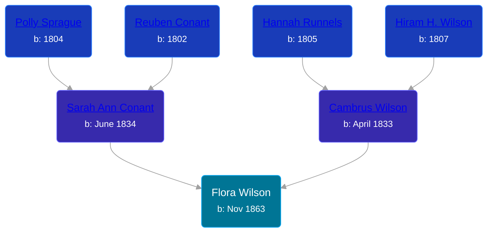

## 🟣 Flora Wilson

Daughter of [Cambrus Wilson](/people/8/82575654) and [Sarah Ann Conant](/people/3/3929404)





### 📆 Events


Type | Date | Age at Event | Place
------ | ------ | ------ | ------
Birth | Nov 1863 |  |
[Residence](#event-event-0) | 15 JUN 1870 | 6y, 7m, 15d | Savannah, Wayne, New York, USA
[Residence](#event-event-1) | 04 JUN 1880 | 16y, 7m, 4d | Butler, Wayne, New York, USA
[Residence](#event-event-2) | 16 FEB 1892 | 28y, 3m, 16d | Savannah, Wayne, New York, USA
[Residence](#event-event-3) | 06 JUN 1900 | 36y, 7m, 6d | Savannah, Wayne, New York, USA



- **Birth**
**Date**: Nov 1863, Age:
**Place**:
- **[Residence](#event-event-0)**
**Date**: 15 JUN 1870, Age: 6y, 7m, 15d
**Place**: Savannah, Wayne, New York, USA
- **[Residence](#event-event-1)**
**Date**: 04 JUN 1880, Age: 16y, 7m, 4d
**Place**: Butler, Wayne, New York, USA
- **[Residence](#event-event-2)**
**Date**: 16 FEB 1892, Age: 28y, 3m, 16d
**Place**: Savannah, Wayne, New York, USA
- **[Residence](#event-event-3)**
**Date**: 06 JUN 1900, Age: 36y, 7m, 6d
**Place**: Savannah, Wayne, New York, USA


## 👩‍❤️‍👨 Relationships

### 🔵 [William Aumock](/people/5/50418111), b. Oct 1858

#### Events


Type | Date | Age at Event | Place
------ | ------ | ------ | ------
Marriage | 1882 | 18y, 1m |



- **Marriage**
**Date**: 1882, Age: 18y, 1m
**Place**:


#### Children With William Aumock
* 🔵 [Raymond Wilson Aumock](/people/1/17962037), b. 02 OCT 1883
* 🔵 [Arthur Aumock](/people/2/29296932), b. May 1889
* 🔵 [Melvin Lionel Aumock](/people/5/52466857), b. 17 MAY 1893
* 🟣 [Reba M. Aumock](/people/2/20205610), b. about 1896
### 📰 Event Sources

####  Residence, 15 JUN 1870
* 1870 US Census

####  Residence, 04 JUN 1880
* 1880 US Census

####  Marriage, 1882

####  Residence, 16 FEB 1892
* 1892 New York Census

####  Residence, 06 JUN 1900
* 1900 US Census