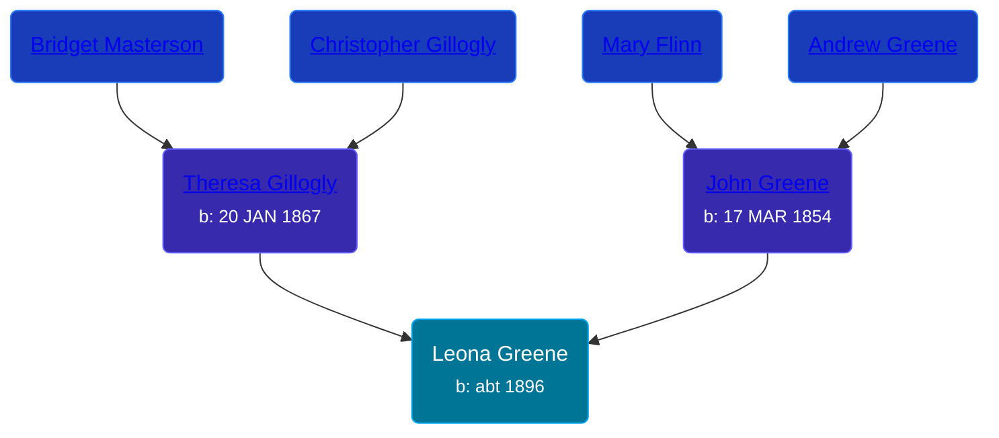

## 🟣 Leona Greene

Daughter of [John Greene](/people/7/71088434) and [Theresa Gillogly](/people/6/67581747)





### 📆 Events


Type | Date | Age at Event | Place
------ | ------ | ------ | ------
Birth | abt 1896 |  | Michigan, USA
[Residence](#event-event-0) | 21 JUN 1900 | 4y, 6m, 21d | Sciota, Shiawassee, Michigan, USA
[Residence](#event-event-1) | 21 APR 1910 | 14y, 4m, 21d | Owosso, Shiawassee, Michigan, USA



- **Birth**
**Date**: abt 1896, Age:
**Place**: Michigan, USA
- **[Residence](#event-event-0)**
**Date**: 21 JUN 1900, Age: 4y, 6m, 21d
**Place**: Sciota, Shiawassee, Michigan, USA
- **[Residence](#event-event-1)**
**Date**: 21 APR 1910, Age: 14y, 4m, 21d
**Place**: Owosso, Shiawassee, Michigan, USA


### 📰 Event Sources

####  Residence, 21 JUN 1900
* 1900 US Census
>   
  > Name: Leona Green  
  > Age: 4  
  > Birth Date: Jun 1895  
  > Birthplace: Michigan, USA  
  > Home in 1900: Sciota, Shiawassee, Michigan  
  > Sheet Number: 14  
  > Number of Dwelling in Order of Visitation: 356  
  > Family Number: 364  
  > Race: White  
  > Gender: Female  
  > Relation to Head of House: Daughter  
  > Marital Status: Single  
  > Father's Name: John Green  
  > Father's Birthplace: Canada English  
  > Mother's Name: Theresa Green  
  > Mother's Birthplace: Canada, England  
  >   
  > Household members:  
  > - John Green, 46, Head  
  > - Theresa Green, 33, Wife  
  > - Andrew Green, 8, Son  
  > - Leona Green, 4, Daughter  
  > - Lallie Green, 2, Daughter  
  > - Agnes Green, 3/12, Daughter  
  >

####  Residence, 21 APR 1910
* 1910 US Census
>   
  > Name: Leona Green  
  > Age in 1910: 14  
  > Birth Date: 1896  
  > Birthplace: Michigan  
  > Home in 1910: Owosso Ward 5, Shiawassee, Michigan, USA  
  > Sheet Number: 10b  
  > Street: Mack  
  > Race: White  
  > Gender: Female  
  > Relation to Head of House: Daughter  
  > Marital Status: Single  
  > Father's Birthplace: Canada  
  > Mother's Birthplace: Canada  
  > Native Tongue: English  
  > Attended School: Y  
  > Able to read: Y  
  > Able to Write: Y  
  > Enumeration District Number: 0093  
  > Enumerated Year: 1910  
  >   
  > Household members:  
  > - John Green, 65, Head    
  > - Theresa Green, 42, Wife    
  > - Andrew Green, 18, Son    
  > - Leona Green, 14, Daughter    
  > - Theresa Green, 12, Daughter    
  > - Agnes Green, 10, Daughter    
  > - Aldon Green, 8, Son    
  > - Helen Green, 2, Daughter    
  >
