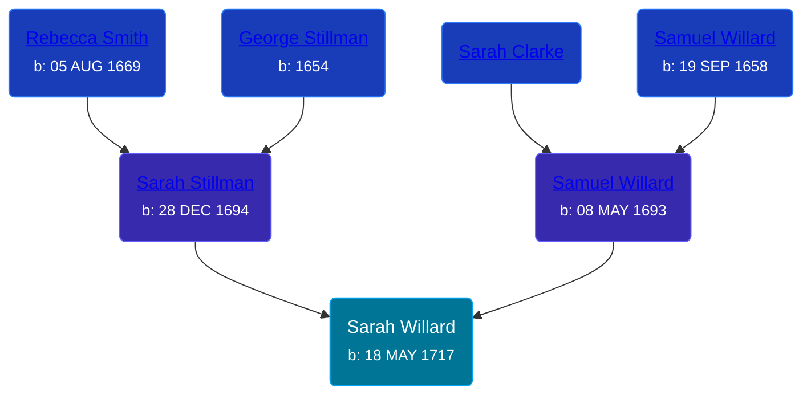

## 🟣 Sarah Willard
<small>Age: 72y, 5m, 8d</small>

Daughter of [Samuel Willard](/people/1/12362566) and [Sarah Stillman](/people/9/9722974)





### 📆 Events


Type | Date | Age at Event | Place
------ | ------ | ------ | ------
[Birth](#event-event-3) | 18 MAY 1717 |  | Saybrook, Middlesex, Connecticut, USA
Death | 26 OCT 1789 | 72y, 5m, 8d | Cheshire, New Haven, Connecticut



- **[Birth](#event-event-3)**
**Date**: 18 MAY 1717, Age:
**Place**: Saybrook, Middlesex, Connecticut, USA
- **Death**
**Date**: 26 OCT 1789, Age: 72y, 5m, 8d
**Place**: Cheshire, New Haven, Connecticut


## 👩‍❤️‍👨 Relationships

### 🔵 [James Jones](/people/6/61233476), b. 16 MAY 1709

#### Events


Type | Date | Age at Event | Place
------ | ------ | ------ | ------
[Marriage](#event-family-0-event-0) | 31 MAY 1737 | 20y, 13d | Saybrook, Middlesex, Connecticut, USA



- **[Marriage](#event-family-0-event-0)**
**Date**: 31 MAY 1737, Age: 20y, 13d
**Place**: Saybrook, Middlesex, Connecticut, USA


#### Children With James Jones
* 🟣 [Living Person](/people/1/1434019)
* 🔵 [Living Person](/people/6/69352096)
* 🔵 [Living Person](/people/4/45197660)
* 🔵 [Living Person](/people/1/10134440)
* 🟣 [Sarah Jones](/people/9/95119732), b. 22 MAY 1741
* 🟣 [Hannah Jones](/people/3/3592220), b. 15 NOV 1741
* 🔵 [James Jones](/people/3/31141841), b. abt 19 JAN 1743
* 🔵 [Timothy Jones](/people/6/63580840), b. 05 JUN 1755
* 🔵 [George Jones](/people/1/12539052), b. 14 FEB 1759
### 📰 Event Sources

####  Birth, 18 MAY 1717
* The Foote Family: or the Descendants of Nathaniel Foote

####  Marriage, 31 MAY 1737
* The New England Historical and Genealogical Register  - 313