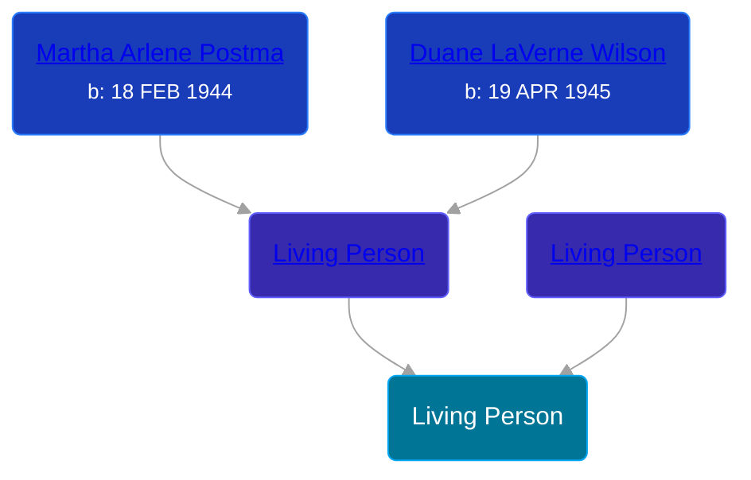

## 🔵 Living Person

Son of [Living Person](/people/6/63426026) and [Living Person](/people/4/46067436)





## 👩‍❤️‍👨 Relationships

### 🟣 [Living Person](/people/3/33630976)

#### Children With Living Person
* 🟣 [Living Person](/people/6/66378416)
### 🟣 [Living Person](/people/4/44586772)

#### Children With Living Person
* 🔵 [Living Person](/people/4/43239855)