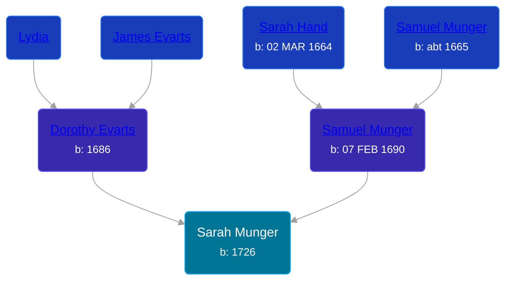

## 🟣 Sarah Munger
<small>Age: 22y, 6m, 8d</small>

Daughter of [Samuel Munger](/people/6/64239804) and [Dorothy Evarts](/people/5/59501816)





### 📆 Events


Type | Date | Age at Event | Place
------ | ------ | ------ | ------
[Birth](#event-event-2) | 1726 |  | South Brimfield, Massachusetts, USA
[Death](#event-event-3) | 08 JUN 1748 | 22y, 6m, 8d |



- **[Birth](#event-event-2)**
**Date**: 1726, Age:
**Place**: South Brimfield, Massachusetts, USA
- **[Death](#event-event-3)**
**Date**: 08 JUN 1748, Age: 22y, 6m, 8d
**Place**:


### 📰 Event Sources

####  Birth, 1726
* The Munger Book  - 221

####  Death, 08 JUN 1748
* The Munger Book  - 221