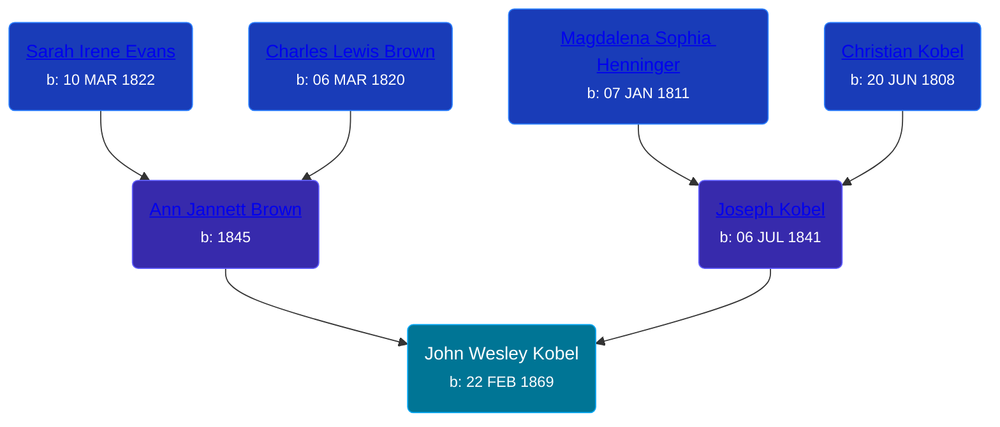

## 🔵 John Wesley Kobel
<small>Age: 57y, 8m, 23d</small>

Son of [Joseph Kobel](/people/4/44694656) and [Ann Jannett Brown](/people/2/25015094)





### 📆 Events


Type | Date | Age at Event | Place
------ | ------ | ------ | ------
[Birth](#event-event-2) | 22 FEB 1869 |  | Union Township, Isabella, Michigan, USA
[Residence](#event-event-0) | 30 JUN 1870 | 1y, 4m, 8d | Union Township, Antrim, Michigan, USA
[Residence](#event-event-1) | 16 JUN 1880 | 11y, 3m, 24d | Union Township, Antrim, Michigan, USA
[Residence](#event-event-2) | 01 JUN 1900 | 31y, 3m, 9d | Warner Township, Antrim, Michigan, USA
[Residence](#event-event-3) | 15 APR 1910 | 41y, 1m, 23d | Warner Township, Antrim, Michigan, USA
[Residence](#event-event-4) | 05 JAN 1920 | 50y, 10m, 13d | Warner Township, Antrim, Michigan, USA
[Death](#event-event-8) | 15 NOV 1926 | 57y, 8m, 23d | Warner Township, Antrim, Michigan, USA
[Burial](#event-event-9) |  |  | Maple Hill Cemetery, Elmira Township, Antrim, Michigan, USA



- **[Birth](#event-event-2)**
**Date**: 22 FEB 1869, Age:
**Place**: Union Township, Isabella, Michigan, USA
- **[Residence](#event-event-0)**
**Date**: 30 JUN 1870, Age: 1y, 4m, 8d
**Place**: Union Township, Antrim, Michigan, USA
- **[Residence](#event-event-1)**
**Date**: 16 JUN 1880, Age: 11y, 3m, 24d
**Place**: Union Township, Antrim, Michigan, USA
- **[Residence](#event-event-2)**
**Date**: 01 JUN 1900, Age: 31y, 3m, 9d
**Place**: Warner Township, Antrim, Michigan, USA
- **[Residence](#event-event-3)**
**Date**: 15 APR 1910, Age: 41y, 1m, 23d
**Place**: Warner Township, Antrim, Michigan, USA
- **[Residence](#event-event-4)**
**Date**: 05 JAN 1920, Age: 50y, 10m, 13d
**Place**: Warner Township, Antrim, Michigan, USA
- **[Death](#event-event-8)**
**Date**: 15 NOV 1926, Age: 57y, 8m, 23d
**Place**: Warner Township, Antrim, Michigan, USA
- **[Burial](#event-event-9)**
**Date**:
**Place**: Maple Hill Cemetery, Elmira Township, Antrim, Michigan, USA


## 👩‍❤️‍👨 Relationships

### 🟣 [Jessie Blanche Holloway](/people/2/29242864), b. 26 APR 1875

#### Events


Type | Date | Age at Event | Place
------ | ------ | ------ | ------
[Marriage](#event-family-0-event-0) | 14 MAR 1892 | 23y, 22d | Mount Pleasant, Isabella, Michigan, USA



- **[Marriage](#event-family-0-event-0)**
**Date**: 14 MAR 1892, Age: 23y, 22d
**Place**: Mount Pleasant, Isabella, Michigan, USA


#### Children With Jessie Blanche Holloway
* 🔵 [Harry William Kobel](/people/3/30496161), b. 10 JUL 1892
* 🔵 [Fred Hayes Kobel](/people/1/1672312), b. 29 JUL 1894
* 🟣 [Bessie Elma Kobel](/people/3/34277096), b. 14 SEP 1896
* 🟣 [Vedah May Kobel](/people/5/52554620), b. 25 SEP 1898
* 🔵 [Joseph Henry Kobel](/people/5/50400728), b. 15 JUL 1900
* 🔵 [Kobel](/people/4/43995845), b. 16 NOV 1902
* 🟣 [Sarah Blanche Kobel](/people/4/40397804), b. 13 JAN 1904
* 🟣 [Mabel Nellie Kobel](/people/6/69123608), b. 28 OCT 1906
* 🟣 [Kobel](/people/7/71908748), b. 29 JAN 1909
* 🟣 [Elvira Jannette Kobel](/people/2/2756961), b. 26 FEB 1910
* 🟣 [Jessie Gertrude Kobel](/people/9/95617946), b. 27 SEP 1918
### 📰 Event Sources

####  Birth, 22 FEB 1869
* Michigan, Births and Christenings Index, 1867-1911
>   
  > Name: John Westly Koble  
  > Gender: Male  
  > Birth Place: Union, Isabella, Michigan  
  > Birth Date: 22 Feb 1869  
  > Father's Name: Joseph Koble  
  > Mother's Name: Ann Jennett Koble  
  > FHL Film Number: 1005117

####  Residence, 30 JUN 1870
* 1870 US Census

####  Residence, 16 JUN 1880
* 1880 US Census

####  Residence, 01 JUN 1900
* 1900 US Census

####  Residence, 15 APR 1910
* 1910 US Census

####  Residence, 05 JAN 1920
* 1920 US Census

####  Death, 15 NOV 1926
* Michigan, Death Records, 1867-1950

####  Burial
* findagrave.com
####  Marriage, 14 MAR 1892
* Michigan, Marriage Records, 1867-1952
>   
  > Name:Jessie B Holloway  
  > Gender:Female  
  > Race:White  
  > Birth Year:abt 1876  
  > Birth Place:Michigan  
  > Marriage Date:14 Mar 1892  
  > Marriage Place:MT Pleasant, Isabella, Michigan, USA  
  > Age:16  
  > Residence Place:Deerfield Township  
  > Father:William R Holloway  
  > Mother:Sadie Hapner  
  > Spouse:John W Kobel  
  > Spouse Gender:Male  
  > Spouse Race:White  
  > Spouse Age:23  
  > Spouse Birth Place:Isabella County  
  > Spouse Residence Place:Antrim Co  
  > Spouse Father:Joseph Kobel  
  > Spouse Mother:Anginett Brown  
  > Record Number:211  
  > Film:46  
  > Film Description:1892 Clinton - 1892 Manistee
