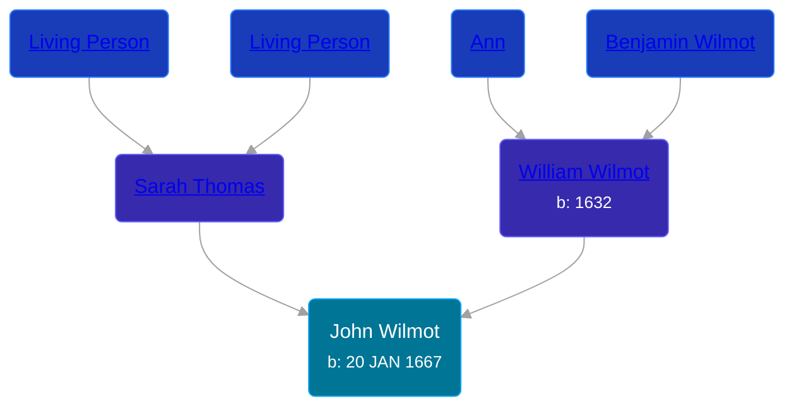

## 🔵 John Wilmot

Son of [William Wilmot](/people/4/47205976) and [Sarah Thomas](/people/2/28506175)





### 📆 Events


Type | Date | Age at Event | Place
------ | ------ | ------ | ------
[Birth](#event-event-2) | 20 JAN 1667 |  |



- **[Birth](#event-event-2)**
**Date**: 20 JAN 1667, Age:
**Place**:


### 📰 Event Sources

####  Birth, 20 JAN 1667
* The New England Historical and Genealogical Register  - 68