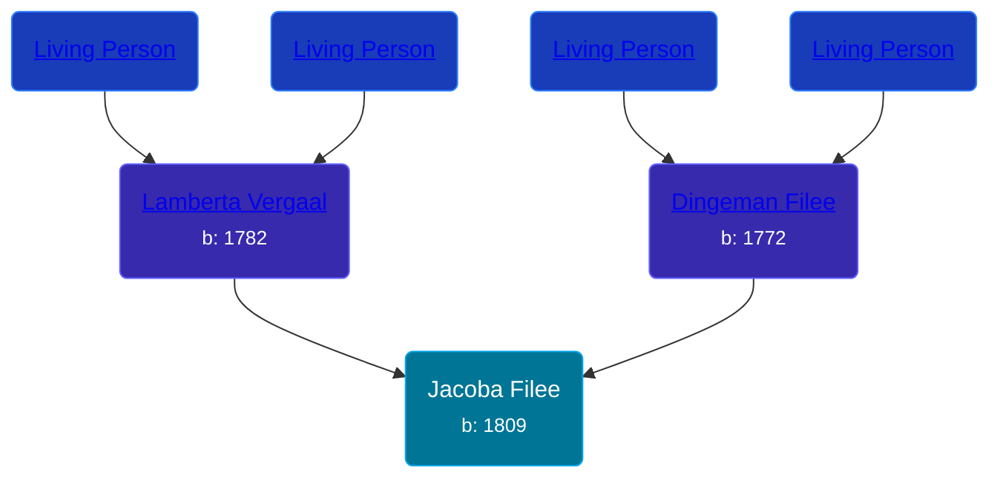

## 🟣 Jacoba Filee
<small>Age: 72y, 8m, 30d</small>

Daughter of [Dingeman Filee](/people/1/19898025) and [Lamberta Vergaal](/people/9/91282624)





### 📆 Events


Type | Date | Age at Event | Place
------ | ------ | ------ | ------
[Birth](#event-event-3) | 1809 |  | Zonnemaire, Zeeland, Netherlands
Death | 30 AUG 1881 | 72y, 8m, 30d | Dreischor, Zeeland, Netherlands



- **[Birth](#event-event-3)**
**Date**: 1809, Age:
**Place**: Zonnemaire, Zeeland, Netherlands
- **Death**
**Date**: 30 AUG 1881, Age: 72y, 8m, 30d
**Place**: Dreischor, Zeeland, Netherlands


## 👩‍❤️‍👨 Relationships

### 🔵 [Cornelis van den Berge](/people/7/76669736), b. 1814

#### Events


Type | Date | Age at Event | Place
------ | ------ | ------ | ------
[Marriage](#event-family-0-event-0) | 02 APR 1841 | 32y, 4m, 2d | Dreischor, Zeeland, Netherlands



- **[Marriage](#event-family-0-event-0)**
**Date**: 02 APR 1841, Age: 32y, 4m, 2d
**Place**: Dreischor, Zeeland, Netherlands


#### Children With Cornelis van den Berge
* 🟣 [Hendrika van den Berge](/people/5/54004146), b. abt 1842
* 🔵 [Dingeman van den Berge](/people/2/24832747), b. abt 1844
* 🟣 [Lavina van den Berge](/people/7/71558365), b. 18 MAY 1850
### 📰 Event Sources

####  Birth, 1809
* Pedigree of Lambert Leendert (Leen) Botvliet

####  Marriage, 02 APR 1841
* Dutch Civil Register
>   
  > Source Civil register - Marriage  
  > Archive location: Zeeuws Archief  
  > General Number of finding aid: 25.25  
  > Municipality: Dreischor  
  > Type of record: Huwelijksakte  
  > Record number: 4  
  > Registration date: 02-04-1841  
  > Groom: Cornelis van den Berge  
  > Age: 27  
  > Place of birth: Dreischor  
  > Bride: Jacoba File  
  > Age: 32  
  > Place of birth: Zonnemaire  
  > Father groom: N N  
  > Mother groom: Hendrika van den Berge  
  > Father bride: Dingeman File  
  > Mother bride: Lamberta Vergaal