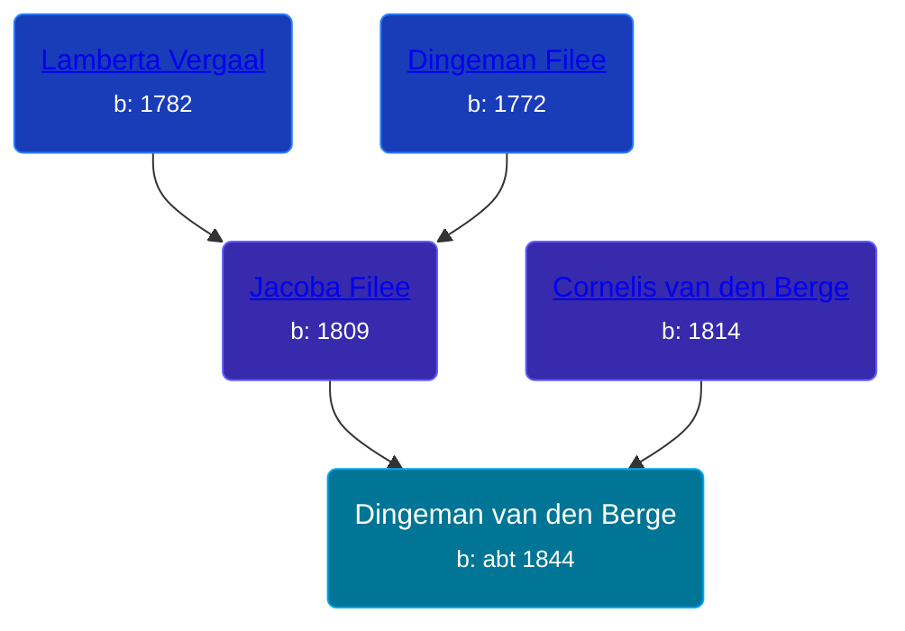

## 🔵 Dingeman van den Berge

Son of [Cornelis van den Berge](/people/7/76669736) and [Jacoba Filee](/people/2/24768838)





### 📆 Events


Type | Date | Age at Event | Place
------ | ------ | ------ | ------
Birth | abt 1844 |  | Dreischor, Zeeland, Netherlands



- **Birth**
**Date**: abt 1844, Age:
**Place**: Dreischor, Zeeland, Netherlands

