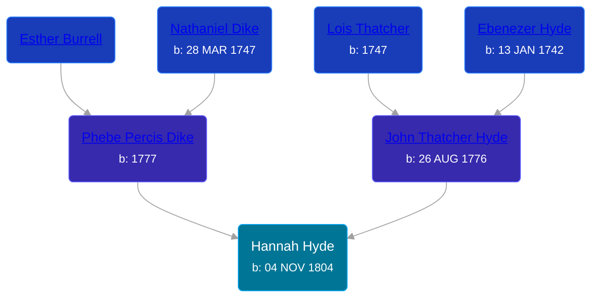

## 🔵 Hannah Hyde
<small>Age: 82y, 11m, 4d</small>

Son of [John Thatcher Hyde](/people/3/3310224) and [Phebe Percis Dike](/people/4/41577072)





### 📆 Events


Type | Date | Age at Event | Place
------ | ------ | ------ | ------
[Birth](#event-event-2) | 04 NOV 1804 |  | Amity, Allegany, New York, USA
[Residence](#event-event-0) | 1850 | 45y, 26d | Amity, Allegany, New York, USA
[Death](#event-event-4) | 08 OCT 1887 | 82y, 11m, 4d |
[Burial](#event-event-5) |  |  | Abbot Cemetery, Amity, Allegany, New York, USA



- **[Birth](#event-event-2)**
**Date**: 04 NOV 1804, Age:
**Place**: Amity, Allegany, New York, USA
- **[Residence](#event-event-0)**
**Date**: 1850, Age: 45y, 26d
**Place**: Amity, Allegany, New York, USA
- **[Death](#event-event-4)**
**Date**: 08 OCT 1887, Age: 82y, 11m, 4d
**Place**:
- **[Burial](#event-event-5)**
**Date**:
**Place**: Abbot Cemetery, Amity, Allegany, New York, USA


## 👩‍❤️‍👨 Relationships

### 🔵 [Hiram Abbott](/people/7/75588804), b.

#### Events


Type | Date | Age at Event | Place
------ | ------ | ------ | ------
[Marriage](#event-family-0-event-0) |  |  |



- **[Marriage](#event-family-0-event-0)**
**Date**:
**Place**:


### 📰 Event Sources

####  Birth, 04 NOV 1804
* History of Allegany County, N.Y

####  Residence, 1850
* 1850 US Census

####  Death, 08 OCT 1887
* Abbot Cemetery

####  Burial
* Abbot Cemetery
####  Marriage
* History of Allegany County, N.Y
