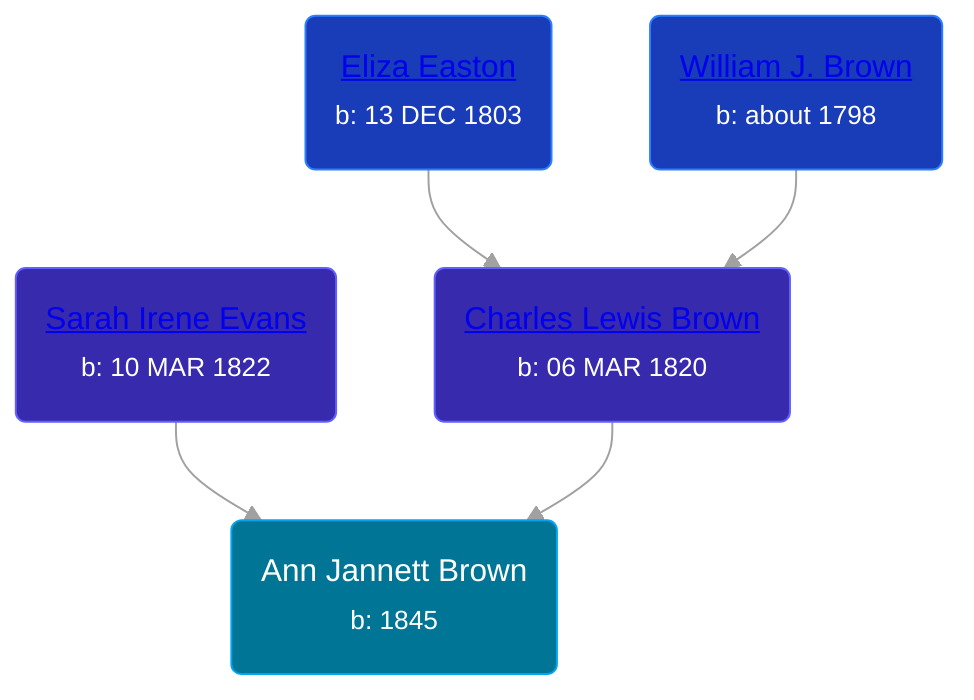

## 🟣 Ann Jannett Brown
<small>Age: 29y, 7m, 26d</small>

Daughter of [Charles Lewis Brown](/people/7/70538697) and [Sarah Irene Evans](/people/4/47294572)





### 📆 Events


Type | Date | Age at Event | Place
------ | ------ | ------ | ------
[Birth](#event-event-3) | 1845 |  | New York, USA
[Residence](#event-event-0) | 1860 | 15y | Bushnell, Montcalm, Michigan, USA
[Residence](#event-event-1) | 30 JUN 1870 | 25y, 6m, 30d | Union Township, Antrim, Michigan, USA
[Death](#event-event-6) | 26 JUL 1874 | 29y, 7m, 26d | Isabella, Michigan, USA



- **[Birth](#event-event-3)**
**Date**: 1845, Age:
**Place**: New York, USA
- **[Residence](#event-event-0)**
**Date**: 1860, Age: 15y
**Place**: Bushnell, Montcalm, Michigan, USA
- **[Residence](#event-event-1)**
**Date**: 30 JUN 1870, Age: 25y, 6m, 30d
**Place**: Union Township, Antrim, Michigan, USA
- **[Death](#event-event-6)**
**Date**: 26 JUL 1874, Age: 29y, 7m, 26d
**Place**: Isabella, Michigan, USA


## 👩‍❤️‍👨 Relationships

### 🔵 [Joseph Kobel](/people/4/44694656), b. 06 JUL 1841

#### Events


Type | Date | Age at Event | Place
------ | ------ | ------ | ------
Marriage | about 1862 | 17y |



- **Marriage**
**Date**: about 1862, Age: 17y
**Place**:


#### Children With Joseph Kobel
* 🔵 [Henry L. Kobel](/people/6/66319774), b. 06 DEC 1863
* 🔵 [John Wesley Kobel](/people/2/24649136), b. 22 FEB 1869
### 📰 Event Sources

####  Birth, 1845
* Ron Wilson's Research

####  Residence, 1860
* 1860 US Census

####  Marriage, about 1862

####  Residence, 30 JUN 1870
* 1870 US Census
####  Death, 26 JUL 1874
* Ron Wilson's Research
