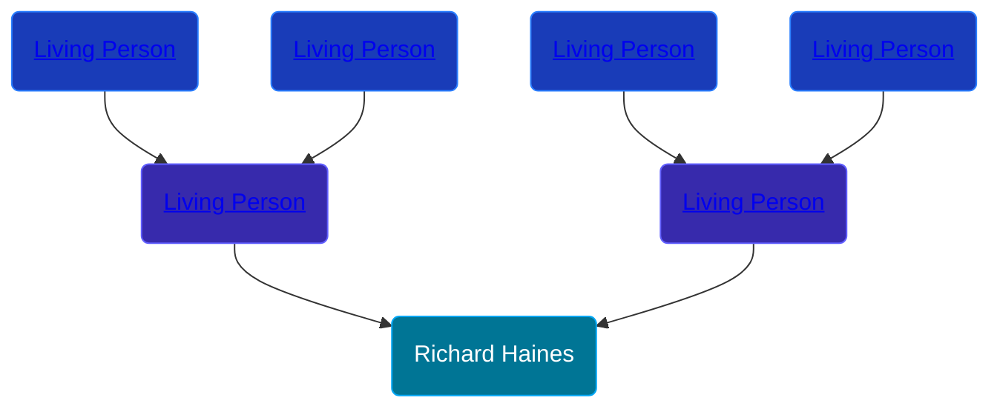

## 🔵 Richard Haines

Son of [Living Person](/people/6/66828208) and [Living Person](/people/2/2215969)





## 👩‍❤️‍👨 Relationships

### 🟣 [Margaret ](/people/5/57067327)

#### Children With Margaret
* 🔵 [William Haines](/people/5/5796916), b. 24 APR 1672