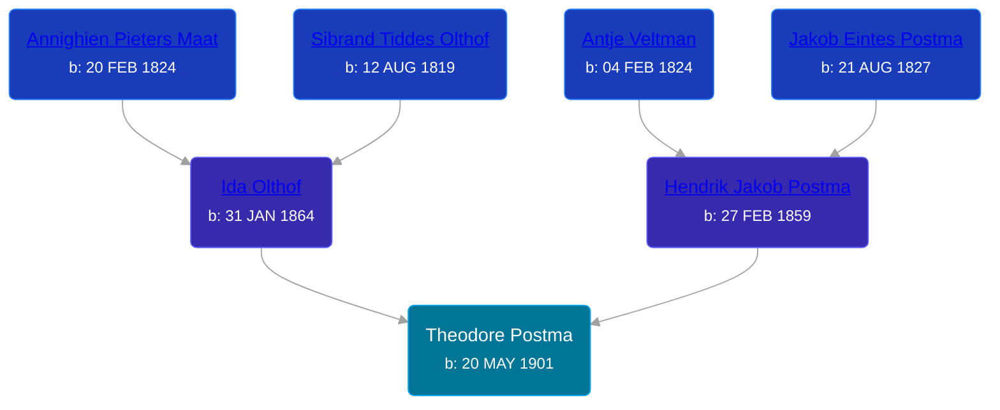

## 🔵 Theodore Postma
<small>Age: 25y, 7m, 4d</small>

Son of [Hendrik Jakob Postma](/people/3/31727152) and [Ida Olthof](/people/6/60020862)





### 📆 Events


Type | Date | Age at Event | Place
------ | ------ | ------ | ------
Birth | 20 MAY 1901 |  |
[Residence](#event-event-0) | 1910 | 8y, 6m, 10d | Gaines Township, Kent, Michigan, USA
[Residence](#event-event-1) | 1920 | 18y, 6m, 10d | Gaines Township, Kent, Michigan, USA
[Death](#event-event-5) | 24 DEC 1926 | 25y, 7m, 4d | Gaines Township, Kent, Michigan, USA
[Burial](#event-event-6) | 27 DEC 1926 | 25y, 7m, 7d | Pine Hill Cemetery, Kentwood, Kent, Michigan, USA



- **Birth**
**Date**: 20 MAY 1901, Age:
**Place**:
- **[Residence](#event-event-0)**
**Date**: 1910, Age: 8y, 6m, 10d
**Place**: Gaines Township, Kent, Michigan, USA
- **[Residence](#event-event-1)**
**Date**: 1920, Age: 18y, 6m, 10d
**Place**: Gaines Township, Kent, Michigan, USA
- **[Death](#event-event-5)**
**Date**: 24 DEC 1926, Age: 25y, 7m, 4d
**Place**: Gaines Township, Kent, Michigan, USA
- **[Burial](#event-event-6)**
**Date**: 27 DEC 1926, Age: 25y, 7m, 7d
**Place**: Pine Hill Cemetery, Kentwood, Kent, Michigan, USA


### 📰 Event Sources

####  Residence, 1910
* 1910 US Census

####  Residence, 1920
* 1920 US Census

####  Death, 24 DEC 1926
* The Grand Rapids Press  - 24 Dec 1926
>   
  > POSTMA -- Theodore Postma, aged 25, passed away Friday morning at his home in Gaines township. Surviving are his parents, Mr. and Mrs. Henry Postma; six brothers, Sybrant, Jake, Peter, Martin, Dewey and Charles Postma, and two sisters, Mrs. Richard Weaver and Miss Clara Postma. Funeral announcement later.
* Michigan, Death Records, 1867-1950
>   
  > Name: Theodore Postma  
  > Gender: Male  
  > Marital Status: Single  
  > Birth Date: May 20, 1901  
  > Birth Place: Michigan  
  > Death Date: 24 Dec 1926  
  > Death Place: Gaines, Kent, Michigan, USA  
  > Death Age: 24  
  > File Number: 004896  
  > Father: Henry Postma  
  > Mother: Ada Olthoff

####  Burial, 27 DEC 1926
* findagrave.com
>   
  > Postma, Theodore  
  > Son of H. & Ida Postma  
  > b: 1902; d: 1926
