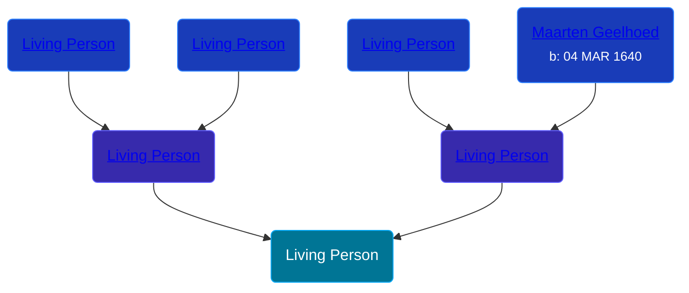

## 🔵 Living Person

Son of [Living Person](/people/2/2482812) and [Living Person](/people/7/73996126)





## 👩‍❤️‍👨 Relationships

### 🟣 [Martha Muste](/people/9/90752360), b. ABT 1731

#### Children With Martha Muste
* 🔵 [Maarten Geelhoed](/people/3/33889936)