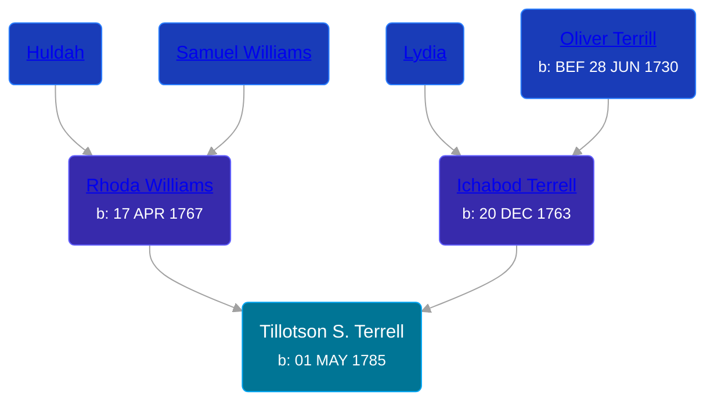

## 🔵 Tillotson S. Terrell
<small>Age: 53y, 7m, 22d</small>

Son of [Ichabod Terrell](/people/6/66420816) and [Rhoda Williams](/people/2/220352)





### 📆 Events


Type | Date | Age at Event | Place
------ | ------ | ------ | ------
[Birth](#event-event-2) | 01 MAY 1785 |  | Waterbury, New Haven, Connecticut, USA
[Residence](#event-event-0) | 1810 | 24y, 6m, 29d | Ridgeville, Cuyahoga, Ohio, USA
[Residence](#event-event-1) | 1830 | 44y, 6m, 29d | Ridgeville, Lorain, Ohio, USA
Death | 23 DEC 1838 | 53y, 7m, 22d | Ridgeville, Lorain, Ohio, USA
[Burial](#event-event-6) |  |  | Ridgeville Cemetery, Ridgeville, Lorain, Ohio, USA



- **[Birth](#event-event-2)**
**Date**: 01 MAY 1785, Age:
**Place**: Waterbury, New Haven, Connecticut, USA
- **[Residence](#event-event-0)**
**Date**: 1810, Age: 24y, 6m, 29d
**Place**: Ridgeville, Cuyahoga, Ohio, USA
- **[Residence](#event-event-1)**
**Date**: 1830, Age: 44y, 6m, 29d
**Place**: Ridgeville, Lorain, Ohio, USA
- **Death**
**Date**: 23 DEC 1838, Age: 53y, 7m, 22d
**Place**: Ridgeville, Lorain, Ohio, USA
- **[Burial](#event-event-6)**
**Date**:
**Place**: Ridgeville Cemetery, Ridgeville, Lorain, Ohio, USA


## 👩‍❤️‍👨 Relationships

### 🟣 [Electa Wilmot](/people/7/77370498), b. 15 FEB 1776

#### Events


Type | Date | Age at Event | Place
------ | ------ | ------ | ------
[Marriage](#event-family-0-event-0) | 1804 | 18y, 6m, 29d | Waterbury, New Haven, Connecticut, USA



- **[Marriage](#event-family-0-event-0)**
**Date**: 1804, Age: 18y, 6m, 29d
**Place**: Waterbury, New Haven, Connecticut, USA


#### Children With Electa Wilmot
* 🔵 [Horatio Terrell](/people/7/74880220), b. 14 NOV 1805
* 🔵 [Eliza Terrell](/people/1/14584373), b. 12 SEP 1807
* 🔵 [Alonzo Philorman Terrell](/people/1/16020599), b. 05 SEP 1809
* 🟣 [Lucinda Terrell](/people/9/94352489), b. 19 DEC 1812
* 🔵 [Andrew Jackson Terrell](/people/1/15331189), b. 01 MAR 1815
* 🟣 [Ester Terrell](/people/2/27094826), b. 05 SEP 1816
* 🟣 [Harriet Terrell](/people/4/44975736), b. 09 JUL 1818
* 🔵 [Tillotson T. Terrell](/people/5/59687792), b. 04 MAR 1821
* 🔵 [Marcus Terrell](/people/2/231106), b. 05 JUN 1822
* 🟣 [Paulina Terrell](/people/1/17012140), b. 30 JUN 1823
* 🔵 [Lovinus Terrell](/people/8/80690232), b. 04 DEC 1824
### 📰 Event Sources

####  Birth, 01 MAY 1785
* The Town and City of Waterbury, Connecticut  - 135

####  Residence, 1810
* 1810 US Census

####  Residence, 1830
* 1830 US Census

####  Burial
* Ohio, Soldier Grave Registrations, 1804-1958
>   
  > Name: Tillotson Terrell  
  > Birth Date: 1 May 1775  
  > Enlistment Date: 27 Aug 1812  
  > Discharge Date: 1 Nov 1812  
  > Death Date: 23 Dec 1838  
  > Burial Place: North Ridgeville, Ohio, USA  
  > Cemetery: Ridgeville  
  > War Served In: War of 1812  
  > Company, outfit or ship: Capt. Calvin Hoadly's Co.  
  > Rank: Private  
  > Branch of Service: Army
* Ridgeville Cemetery
>   
  > TERRELL  
  > Tillotson, Waterbury CT May 1, 1775 or (85)-Dec 23, 1838 War 1812  
  > Electa WILMONT, wife, Feb 15, 1776-Nov 22, 1861

####  Marriage, 1804
* Genealogy: A Journal of American Ancestry