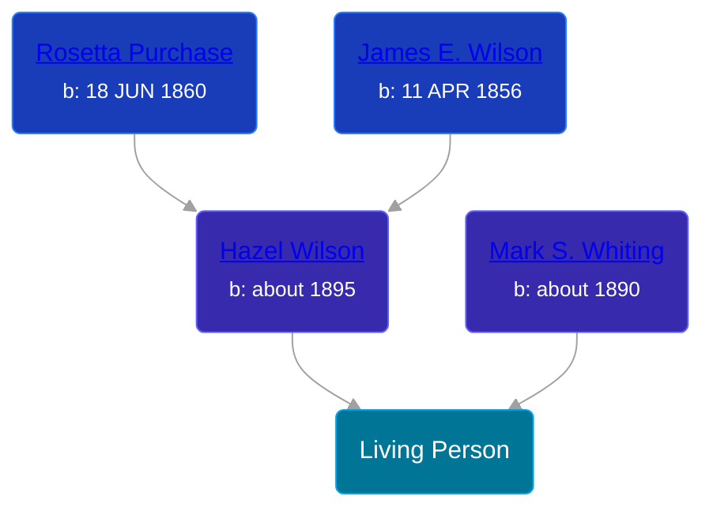

## 🟣 Living Person

Daughter of [Mark S. Whiting](/people/7/73821567) and [Hazel Wilson](/people/2/23514264)



```mermaid
graph
classDef grands fill:#193cb8,stroke:#2b7fff,stroke-width:1px,color:#fff;
classDef parents fill:#372aac,stroke:#615fff,stroke-width:1px,color:#fff;
classDef primary fill:#007595,stroke:#00a6f4,stroke-width:1px,color:#fff;
25706609(Living Person):::primary
23514264(<a class="text-white" href="/people/2/23514264">Hazel Wilson</a><br /><small>b: about 1895</small>):::parents-->25706609
27770192(<a class="text-white" href="/people/2/27770192">Rosetta Purchase</a><br /><small>b: 18 JUN 1860</small>):::grands-->23514264
54950695(<a class="text-white" href="/people/5/54950695">James E. Wilson</a><br /><small>b: 11 APR 1856</small>):::grands-->23514264
73821567(<a class="text-white" href="/people/7/73821567">Mark S. Whiting</a><br /><small>b: about 1890</small>):::parents-->25706609
linkStyle default stroke:#a1a1a1
```

