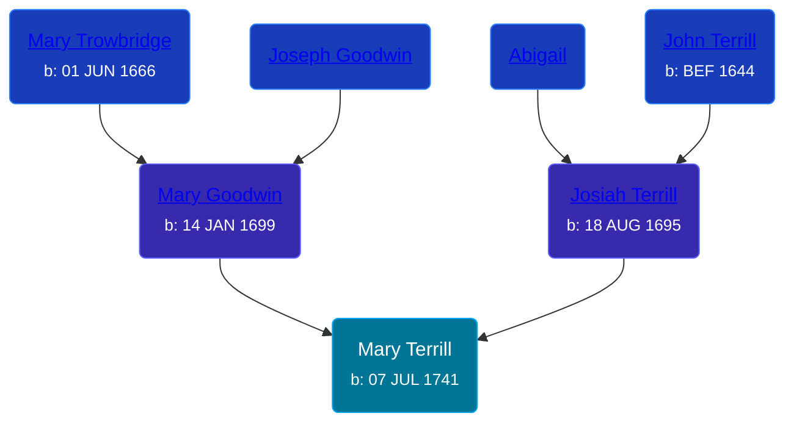

## 🟣 Mary Terrill
<small>Age: 72y, 10m, 3d</small>

Daughter of [Josiah Terrill](/people/8/80183041) and [Mary Goodwin](/people/4/49404198)





### 📆 Events


Type | Date | Age at Event | Place
------ | ------ | ------ | ------
[Birth](#event-event-2) | 07 JUL 1741 |  | Waterbury, New Haven, Connecticut, USA
[Death](#event-event-3) | 10 MAY 1814 | 72y, 10m, 3d |



- **[Birth](#event-event-2)**
**Date**: 07 JUL 1741, Age:
**Place**: Waterbury, New Haven, Connecticut, USA
- **[Death](#event-event-3)**
**Date**: 10 MAY 1814, Age: 72y, 10m, 3d
**Place**:


### 📰 Event Sources

####  Birth, 07 JUL 1741
* Roger and Abigail (Ufford) Terrill and Some Descendants: 1632 - 1993  - 22
* The Town and City of Waterbury, Connecticut  - 135

####  Death, 10 MAY 1814
* Roger and Abigail (Ufford) Terrill and Some Descendants: 1632 - 1993  - 40