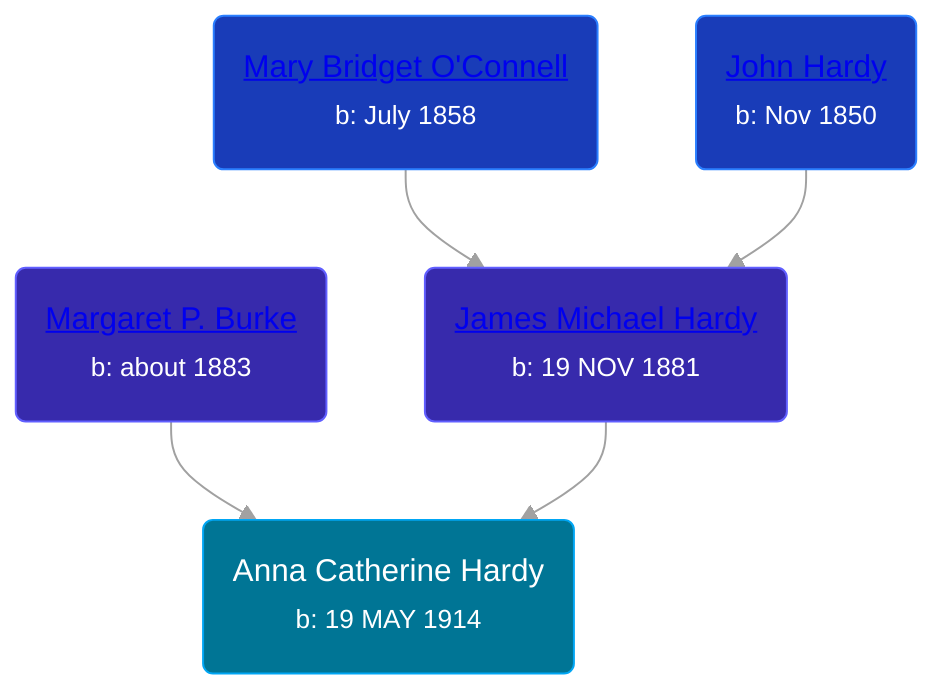

## 🟣 Anna Catherine Hardy
<small>Age: 85y, 5m, 23d</small>

Daughter of [James Michael Hardy](/people/1/11204316) and [Margaret P. Burke](/people/2/29782872)





### 📆 Events


Type | Date | Age at Event | Place
------ | ------ | ------ | ------
Birth | 19 MAY 1914 |  | Omaha, Douglas, Nebraska, USA
[Residence](#event-event-0) | 08 JAN 1920 | 5y, 7m, 19d | Omaha, Douglas, Nebraska, USA
[Residence](#event-event-1) | 16 APR 1930 | 15y, 10m, 27d | Omaha, Douglas, Nebraska, USA
[Residence](#event-event-2) | 1935 | 20y, 6m, 11d | Sioux City, Woodbury, Iowa, USA
[Residence](#event-event-3) | 18 APR 1940 | 25y, 10m, 29d | Sioux City, Woodbury, Iowa, USA
[Death](#event-event-8) | 12 NOV 1999 | 85y, 5m, 23d |
[Burial](#event-event-9) |  |  | Calvary Cemetery, Sioux City, Woodbury, Iowa, USA



- **Birth**
**Date**: 19 MAY 1914, Age:
**Place**: Omaha, Douglas, Nebraska, USA
- **[Residence](#event-event-0)**
**Date**: 08 JAN 1920, Age: 5y, 7m, 19d
**Place**: Omaha, Douglas, Nebraska, USA
- **[Residence](#event-event-1)**
**Date**: 16 APR 1930, Age: 15y, 10m, 27d
**Place**: Omaha, Douglas, Nebraska, USA
- **[Residence](#event-event-2)**
**Date**: 1935, Age: 20y, 6m, 11d
**Place**: Sioux City, Woodbury, Iowa, USA
- **[Residence](#event-event-3)**
**Date**: 18 APR 1940, Age: 25y, 10m, 29d
**Place**: Sioux City, Woodbury, Iowa, USA
- **[Death](#event-event-8)**
**Date**: 12 NOV 1999, Age: 85y, 5m, 23d
**Place**:
- **[Burial](#event-event-9)**
**Date**:
**Place**: Calvary Cemetery, Sioux City, Woodbury, Iowa, USA


## 👩‍❤️‍👨 Relationships

### 🔵 [William Henry Jordan](/people/3/32091032), b. 10 MAY 1905

#### Children With William Henry Jordan
* 🔵 [Living Person](/people/7/71455712)
* 🟣 [Living Person](/people/8/81156064)
* 🟣 [Patricia Jane Jordan](/people/8/8578400), b. 14 JAN 1936
* 🟣 [Living Person](/people/1/16458922)
* 🟣 [Joyce Elaine Jordan](/people/8/86240475), b. 18 MAY 1939
### 📰 Event Sources

####  Residence, 08 JAN 1920
* 1920 US Census

####  Residence, 16 APR 1930
* 1930 US Census

####  Residence, 1935
* 1940 US Census

####  Residence, 18 APR 1940
* 1940 US Census

####  Death, 12 NOV 1999
* U.S., Social Security Applications and Claims Index, 1936-2007
>   
  > Name: Anna Catherine Jordan  
  > [Anna Catherine Pedersen]  
  > [Anna Pedersen]  
  > [Anna Catherine Hardy]  
  > Gender: Female  
  > Race: White  
  > Birth Date: 19 May 1914  
  > Birth Place: Omaha Dougla, Nebraska  
  > Death Date: 12 Nov 1999  
  > Father: James M Hardy  
  > Mother: Margaret P Burke  
  > Type of Claim: Original SSN.  
  > Notes: Sep 1942:  Name listed as ANNA CATHERINE JORDAN; Apr 1974:  Name listed as ANNA CATHERINE PEDERSEN; 19 Nov 1999:  Name listed as ANNA C PEDERSEN
* U.S., Social Security Death Index, 1935-2014
>   
  > Name: Anna C. Pedersen  
  > Last Residence: 51103 Sioux City, Woodbury, Iowa, USA  
  > BORN: 19 May 1914  
  > Died: 12 Nov 1999  
  > State (Year) SSN issued: Iowa (Before 1951)

####  Burial
* findagrave.com
