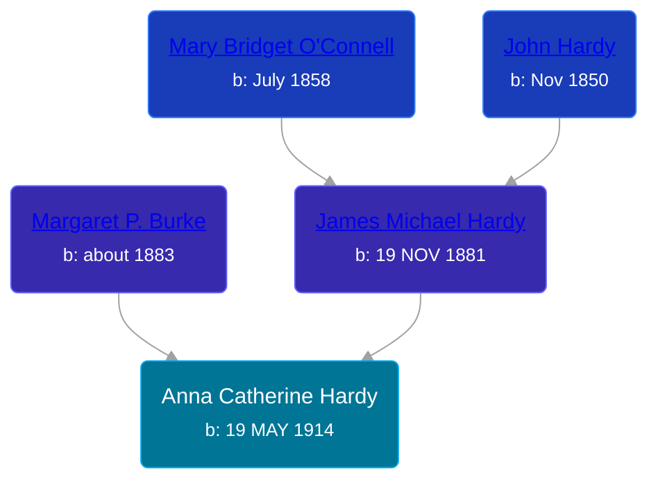

## 🟣 Anna Catherine Hardy
<small>Age: 85y, 5m, 23d</small>

Daughter of [James Michael Hardy](/people/1/11204316) and [Margaret P. Burke](/people/2/29782872)



```mermaid
graph
classDef grands fill:#193cb8,stroke:#2b7fff,stroke-width:1px,color:#fff;
classDef parents fill:#372aac,stroke:#615fff,stroke-width:1px,color:#fff;
classDef primary fill:#007595,stroke:#00a6f4,stroke-width:1px,color:#fff;
25919759(Anna Catherine Hardy<br /><small>b: 19 MAY 1914</small>):::primary
29782872(<a class="text-white" href="/people/2/29782872">Margaret P. Burke</a><br /><small>b: about 1883</small>):::parents-->25919759
11204316(<a class="text-white" href="/people/1/11204316">James Michael Hardy</a><br /><small>b: 19 NOV 1881</small>):::parents-->25919759
47047024(<a class="text-white" href="/people/4/47047024">Mary Bridget O'Connell</a><br /><small>b: July 1858</small>):::grands-->11204316
56182816(<a class="text-white" href="/people/5/56182816">John Hardy</a><br /><small>b: Nov 1850</small>):::grands-->11204316
linkStyle default stroke:#a1a1a1
```


### 📆 Events


Type | Date | Age at Event | Place
------ | ------ | ------ | ------
[Birth](#event-event-3) | 19 MAY 1914 |  | Omaha, Douglas, Nebraska, USA
[Residence](#event-event-0) | 08 JUN 1920 | 6y, 19d | Omaha, Douglas, Nebraska, USA
[Residence](#event-event-1) | 16 APR 1930 | 15y, 10m, 27d | Omaha, Douglas, Nebraska, USA
[Residence](#event-event-2) | 1935 | 20y, 6m, 11d | Sioux City, Woodbury, Iowa, USA
[Residence](#event-event-3) | 18 APR 1940 | 25y, 10m, 29d | Sioux City, Woodbury, Iowa, USA
[Residence](#event-event-4) | 04 APR 1950 | 35y, 10m, 15d | Sioux City, Woodbury, Iowa, USA
[Death](#event-event-9) | 12 NOV 1999 | 85y, 5m, 23d |
[Burial](#event-event-10) |  |  | Calvary Cemetery, Sioux City, Woodbury, Iowa, USA



- **[Birth](#event-event-3)**
**Date**: 19 MAY 1914, Age:
**Place**: Omaha, Douglas, Nebraska, USA
- **[Residence](#event-event-0)**
**Date**: 08 JUN 1920, Age: 6y, 19d
**Place**: Omaha, Douglas, Nebraska, USA
- **[Residence](#event-event-1)**
**Date**: 16 APR 1930, Age: 15y, 10m, 27d
**Place**: Omaha, Douglas, Nebraska, USA
- **[Residence](#event-event-2)**
**Date**: 1935, Age: 20y, 6m, 11d
**Place**: Sioux City, Woodbury, Iowa, USA
- **[Residence](#event-event-3)**
**Date**: 18 APR 1940, Age: 25y, 10m, 29d
**Place**: Sioux City, Woodbury, Iowa, USA
- **[Residence](#event-event-4)**
**Date**: 04 APR 1950, Age: 35y, 10m, 15d
**Place**: Sioux City, Woodbury, Iowa, USA
- **[Death](#event-event-9)**
**Date**: 12 NOV 1999, Age: 85y, 5m, 23d
**Place**:
- **[Burial](#event-event-10)**
**Date**:
**Place**: Calvary Cemetery, Sioux City, Woodbury, Iowa, USA


## 👩‍❤️‍👨 Relationships

### 🔵 [William Henry Jordan](/people/3/32091032), b. 10 MAY 1905

#### Children With William Henry Jordan
* 🔵 [Living Person](/people/7/71455712)
* 🟣 [Living Person](/people/8/81156064)
* 🟣 [Patricia Jane Jordan](/people/8/8578400), b. 14 JAN 1936
* 🟣 [Living Person](/people/1/16458922)
* 🟣 [Joyce Elaine Jordan](/people/8/86240475), b. 18 MAY 1939
* 🟣 [Janice Loraine Jordan](/people/8/83725048), b. 20 APR 1941
### 📰 Event Sources

####  Birth, 19 MAY 1914
* Nebraska, U.S., Birth Ledgers, 1904-1911, Birth Index, 1912-2004
>   
  > Name: Anna C Hardy  
  > Gender: Female  
  > Birth Date: 19 May 1914  
  > Birth Place: Douglas, Nebraska, USA  
  > Parent 1 Name: James Hardy  
  > Certificate Number: 09339  
  > Birth Certificate Type: Normal

####  Residence, 08 JUN 1920
* 1920 US Census

####  Residence, 16 APR 1930
* 1930 US Census

####  Residence, 1935
* 1940 US Census

####  Residence, 18 APR 1940
* 1940 US Census

####  Residence, 04 APR 1950
* 1950 US Census
>   
  > Name: Anna C Jordan  
  > Age: 35  
  > Birth Date: abt 1915  
  > Gender: Female  
  > Race: White  
  > Birth Place: Nebraska  
  > Marital Status: Married  
  > Relation to Head of House: Wife  
  > Residence Date: 1950  
  > Home in 1950: Sioux City, Woodbury, Iowa, USA  
  > Street Name: 10th St  
  > House Number: 210  
  > Dwelling Number: 245  
  > Farm: No  
  > Acres: No  
  > Occupation: Bonding machine operator  
  > Industry: Meat Packing Plant  
  > Occupation Category: Unable to Work  
  > Hours Worked: 36  
  >   
  > Household members:  
  > - William H Jordan, 45, Head  
  > - Anna C Jordan, 35, Wife  
  > - Robert E Jordan, 18, Son  
  > - Mary Anne Jordan, 15, Daughter  
  > - Patricia J Jordan, 14, Daughter  
  > - Margaret C Jordan, 12, Daughter  
  > - Joyce Elaine Jordan, 10, Daughter  
  >

####  Death, 12 NOV 1999
* Sioux City Journal  - 15 Nov 1999, page 12
>   
  > Anna Jordan Pedersen  
  >   
  > Anna C. Jordan Pedersen, 85, of Sioux City died Friday, Nov. 12, 1999, at a Sioux City hospital.  
  >   
  > Services will be at 10:30 a.m. Tuesday at St. Boniface Catholic Church, with the Rev. Kevin Richter officiating. Burial will be in Calvary Cemetery. Visitation will be 1 to 9 p.m. today, with the family present 6:30 to 8 p.m., a rosary said at 6:30 p.m. and a parish vigil at 7 p.m., at Larkin Northside Funeral Home.  
  >   
  > Mrs. Jordan Pedersen was born May 19, 1914, at Omaha, the daughter of James and Margret (Burke) Hardy. She graduated from High School in Omaha. She came to Sioux City in the early 1930s.  
  >   
  > She married William H. Jordan on June 24, 1930, in Sioux City. He died Aug. 27, 1960, in Sioux City.  
  >   
  > In 1966, she married Alfred E. Pedersen. He died in 1967 in Sioux City.  
  >   
  > She worked on the surgical floor at St. Vincent's Hospital and later for Marian Health Center. She retired in 1981.  
  >   
  > She was a member of St. Boniface Catholic Church.  
  >   
  > Survivors include three daughters: Mary Emerick, Margaret and her husband, Jerry Emerick, and Patricia Hanson, all of Sioux City; 22 grandchildren; 31 great-grandchildren; seven great-great-grandchildren; and two sisters: Helen Peabody of Jacksonville, Fla., and Agnes Simon of Sioux City.  
  >   
  > She was preceded in death by two daughters: Janice in infancy, and Joyce Leming; a son, Robert Jordan; and a granddaughter, Renee Suggitt.  
  >   
  > Pallbearers will be Bob, Scott, Bill, and Mick Emerick, and Randy and Russ Suggitt.  
  >   
  > A memorial has been established in her name.
* U.S., Social Security Applications and Claims Index, 1936-2007
>   
  > Name: Anna Catherine Jordan  
  > [Anna Catherine Pedersen]  
  > [Anna Pedersen]  
  > [Anna Catherine Hardy]  
  > Gender: Female  
  > Race: White  
  > Birth Date: 19 May 1914  
  > Birth Place: Omaha Dougla, Nebraska  
  > Death Date: 12 Nov 1999  
  > Father: James M Hardy  
  > Mother: Margaret P Burke  
  > Type of Claim: Original SSN.  
  > Notes: Sep 1942:  Name listed as ANNA CATHERINE JORDAN; Apr 1974:  Name listed as ANNA CATHERINE PEDERSEN; 19 Nov 1999:  Name listed as ANNA C PEDERSEN
* U.S., Social Security Death Index, 1935-2014
>   
  > Name: Anna C. Pedersen  
  > Last Residence: 51103 Sioux City, Woodbury, Iowa, USA  
  > BORN: 19 May 1914  
  > Died: 12 Nov 1999  
  > State (Year) SSN issued: Iowa (Before 1951)

####  Burial
* findagrave.com