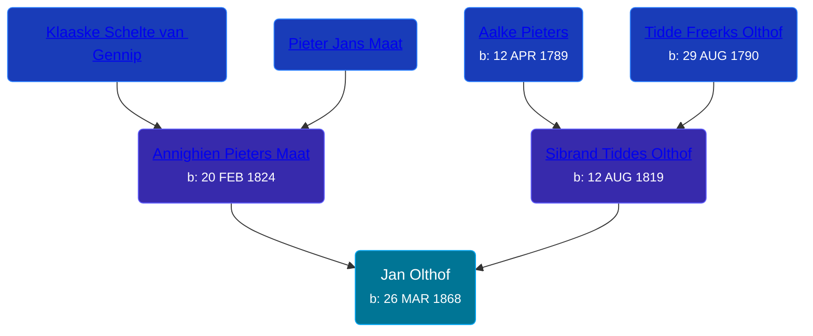

## 🔵 Jan Olthof
<small>Age: 77y, 10m, 15d</small>

Son of [Sibrand Tiddes Olthof](/people/7/76433820) and [Annighien Pieters Maat](/people/7/7249878)





### 📆 Events


Type | Date | Age at Event | Place
------ | ------ | ------ | ------
[Birth](#event-event-2) | 26 MAR 1868 |  | Loppersum, Netherlands
[Death](#event-event-3) | 11 FEB 1946 | 77y, 10m, 15d | Spring Lake, Ottawa, Michigan, USA



- **[Birth](#event-event-2)**
**Date**: 26 MAR 1868, Age:
**Place**: Loppersum, Netherlands
- **[Death](#event-event-3)**
**Date**: 11 FEB 1946, Age: 77y, 10m, 15d
**Place**: Spring Lake, Ottawa, Michigan, USA


### 📰 Event Sources

####  Birth, 26 MAR 1868
* Netherlands, Birth Index, 1784-1917
>   
  > Name: Jan Olthof  
  > Birth Date: 26 mei 1868 (26 May 1868)  
  > Birth Place: Loppersum  
  > Father: Sijbrand Olthof  
  > Mother: Annechien Pieters Maat

####  Death, 11 FEB 1946
* Michigan, Death Records, 1867-1950
>   
  > Name: John Olthof  
  > Gender: Male  
  > Race: White  
  > Marital Status: Widowed  
  > Death Age: 77  
  > Birth Date: 26 May 1868  
  > Birth Place: Netherlands  
  > Death Date: 11 Feb 1946  
  > Death Place: Spring Lake, Ottawa, Michigan, USA  
  > File Number: 006610  
  > Father: Sybrndt Olthof