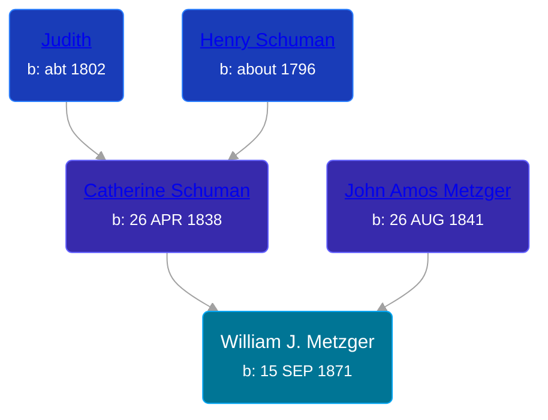

## 🔵 William J. Metzger
<small>Age: 70y, 7m, 19d</small>

Son of [John Amos Metzger](/people/2/28893894) and [Catherine Schuman](/people/3/39599940)





### 📆 Events


Type | Date | Age at Event | Place
------ | ------ | ------ | ------
Birth | 15 SEP 1871 |  | Whitley, Indiana, USA
[Residence](#event-event-0) | 1880 | 8y, 2m, 15d | Richland, Whitley, Indiana, USA
[Residence](#event-event-1) | 1900 | 28y, 2m, 15d | Pleasant Township, Wabash, Indiana, USA
[Residence](#event-event-2) | 1910 | 38y, 2m, 15d | Pleasant Township, Wabash, Indiana, USA
[Residence](#event-event-3) | 1920 | 48y, 2m, 15d | Pleasant Township, Wabash, Indiana, USA
[Residence](#event-event-4) | 1930 | 58y, 2m, 15d | Pleasant Township, Wabash, Indiana, USA
[Death](#event-event-8) | 04 MAY 1942 | 70y, 7m, 19d | North Manchester, Wabash, Indiana, USA
Burial |  |  | Dunkard Church, North Manchester, Wabash, Indiana, USA



- **Birth**
**Date**: 15 SEP 1871, Age:
**Place**: Whitley, Indiana, USA
- **[Residence](#event-event-0)**
**Date**: 1880, Age: 8y, 2m, 15d
**Place**: Richland, Whitley, Indiana, USA
- **[Residence](#event-event-1)**
**Date**: 1900, Age: 28y, 2m, 15d
**Place**: Pleasant Township, Wabash, Indiana, USA
- **[Residence](#event-event-2)**
**Date**: 1910, Age: 38y, 2m, 15d
**Place**: Pleasant Township, Wabash, Indiana, USA
- **[Residence](#event-event-3)**
**Date**: 1920, Age: 48y, 2m, 15d
**Place**: Pleasant Township, Wabash, Indiana, USA
- **[Residence](#event-event-4)**
**Date**: 1930, Age: 58y, 2m, 15d
**Place**: Pleasant Township, Wabash, Indiana, USA
- **[Death](#event-event-8)**
**Date**: 04 MAY 1942, Age: 70y, 7m, 19d
**Place**: North Manchester, Wabash, Indiana, USA
- **Burial**
**Date**:
**Place**: Dunkard Church, North Manchester, Wabash, Indiana, USA


## 👩‍❤️‍👨 Relationships

### 🟣 [Nora E. Butterbaugh](/people/7/71546258), b. Oct 1874

#### Children With Nora E. Butterbaugh
* 🟣 [Lulu M. Metzger](/people/2/28324145), b. Jan 1895
* 🟣 [Mabel F. Metzger](/people/6/66583980), b. Jan 1898
* 🟣 [Tressa S. Metzger](/people/1/13755640), b. about 1905
* 🟣 [Living Person](/people/2/299104)
### 📰 Event Sources

####  Residence, 1880
* 1880 US Census

####  Residence, 1900
* 1900 US Census

####  Residence, 1910
* 1910 US Census

####  Residence, 1920
* 1920 US Census

####  Residence, 1930
* 1930 US Census

####  Death, 04 MAY 1942
* Wabash Plain Dealer  - 6 May 1942, pg 8
>   
  > Funeral services for William J. Metzger, 70, who died Wednesday afternoon in his home west of North Manchester, will be held Saturday afternoon at 2 o'clock in the Old Order Dunkard Church one mile west of North Manchester. O. A. Custer will officiate at services.  
  >   
  > Death was caused by coronary occlusion. The body was returned from the Bender's Funeral Home to the family residence Thursday night where it will remain until services Saturday. Burial will be in the Dunkard Church Cemetery.  
  >   
  > William J. Metzger was born September 15, 1871, in Whitley County to John A. and Catherine Schuman Metzger. He had spent most of his life in Wabash County as a farmer. He married Nora Ellen Butterbaugh who survives. He was a member of the Old Order Dunkard Church.  
  >   
  > Sruvivors besides the widow are one son, Cecil, at home, three daughters, Mrs. Walter Karn and Mrs. Aaron Greer, both of North Manchester, and Miss Tressie Metzger at home, one brother, Abe Metzger of Pierceton, and one sister, Mrs. Alice Spohn of Huntington.
