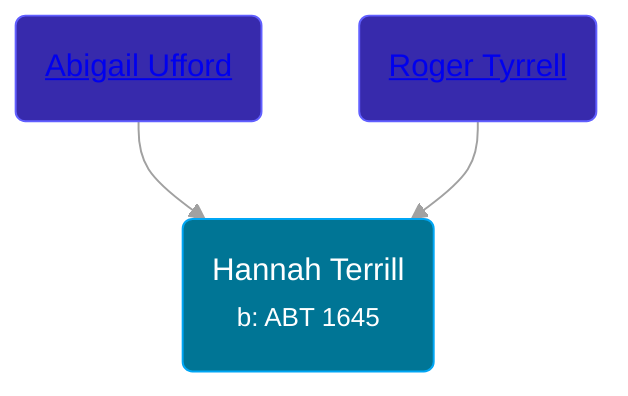

## 🟣 Hannah Terrill
<small>Age: 85y, 11m, 11d</small>

Daughter of [Roger Tyrrell](/people/2/2108514) and [Abigail Ufford](/people/9/99473444)





### 📆 Events


Type | Date | Age at Event | Place
------ | ------ | ------ | ------
[Birth](#event-event-2) | ABT 1645 |  |
[Baptism](#event-event-0) | 1645 |  |
[Death](#event-event-4) | 11 NOV 1730 | 85y, 11m, 11d |



- **[Birth](#event-event-2)**
**Date**: ABT 1645, Age:
**Place**:
- **[Baptism](#event-event-0)**
**Date**: 1645, Age:
**Place**:
- **[Death](#event-event-4)**
**Date**: 11 NOV 1730, Age: 85y, 11m, 11d
**Place**:


### 📰 Event Sources

####  Birth, ABT 1645
* Roger and Abigail (Ufford) Terrill and Some Descendants: 1632 - 1993  - 6

####  Baptism, 1645
* Roger and Abigail (Ufford) Terrill and Some Descendants: 1632 - 1993  - 11

####  Death, 11 NOV 1730
* Roger and Abigail (Ufford) Terrill and Some Descendants: 1632 - 1993  - 11