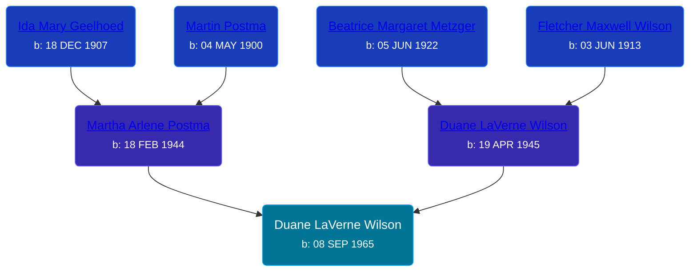

## 🔵 Duane LaVerne Wilson
<small>Age: 1y, 1m, 8d</small>

Son of [Duane LaVerne Wilson](/people/6/61086158) and [Martha Arlene Postma](/people/3/39368292)





### 📆 Events


Type | Date | Age at Event | Place
------ | ------ | ------ | ------
Birth | 08 SEP 1965 |  | Grand Rapids, Kent, Michigan, United States
[Death](#event-event-3) | 16 OCT 1966 | 1y, 1m, 8d | Grand Rapids, Kent, Michigan, United States
Burial | 19 OCT 1966 | 1y, 1m, 11d | Rest Lawn Memorial Park, Grand Rapids, Kent, Michigan, United States



- **Birth**
**Date**: 08 SEP 1965, Age:
**Place**: Grand Rapids, Kent, Michigan, United States
- **[Death](#event-event-3)**
**Date**: 16 OCT 1966, Age: 1y, 1m, 8d
**Place**: Grand Rapids, Kent, Michigan, United States
- **Burial**
**Date**: 19 OCT 1966, Age: 1y, 1m, 11d
**Place**: Rest Lawn Memorial Park, Grand Rapids, Kent, Michigan, United States


### 📰 Event Sources

####  Death, 16 OCT 1966
* The Grand Rapids Press  - 10/17/1966
>   
  > WILSON -- Duane LaVerne Wilson Jr., aged 13 months, son of Duane L., and Martha (Postma) Wilson of 1865 Stafford Ave. SW, passed away unexpectedly Sunday morning. Besides the parents survivors include one sister, Kelly Sue; the grandparents, Mr. and Mrs. F. M. Wilson, Wyoming; Mrs. Martin Postma, Cutlerville, great-grandparents, Mrs. O. Wilson, Mrs. B. Metzger and several aunts and uncles. Master Duane reposes at theVanderpool Chapel, 3131 S. Division Ave., where funeral services willbe held Wednesday at 1:30 p.m. Interment Babyland, at Restlawn Memorial Park with Rev. E. A. DuBois officiating.
