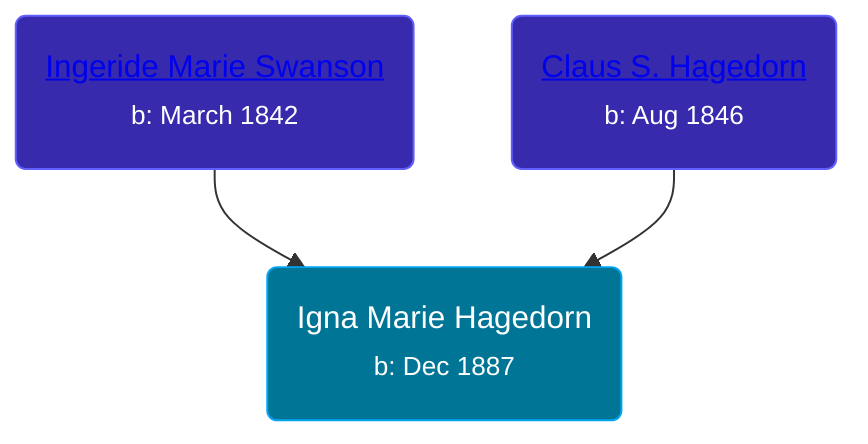

## 🟣 Igna Marie Hagedorn

Daughter of [Claus S. Hagedorn](/people/8/89695136) and [Ingeride Marie Swanson](/people/4/41786466)





### 📆 Events


Type | Date | Age at Event | Place
------ | ------ | ------ | ------
Birth | Dec 1887 |  | Germany
[Immigration](#event-event-0) | 1897 | 9y | USA
[Residence](#event-event-1) | 12 JUN 1900 | 12y, 6m, 12d | Peterson Township, Clay, Iowa, USA



- **Birth**
**Date**: Dec 1887, Age:
**Place**: Germany
- **[Immigration](#event-event-0)**
**Date**: 1897, Age: 9y
**Place**: USA
- **[Residence](#event-event-1)**
**Date**: 12 JUN 1900, Age: 12y, 6m, 12d
**Place**: Peterson Township, Clay, Iowa, USA


### 📰 Event Sources

####  Immigration, 1897
* 1900 US Census

####  Residence, 12 JUN 1900
* 1900 US Census
