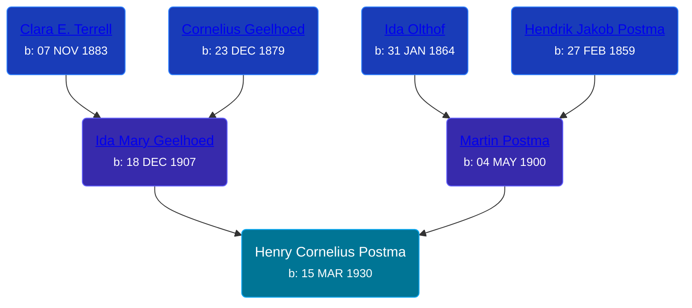

## 🔵 Henry Cornelius Postma
<small>Age: 57y, 1m, 22d</small>

Son of [Martin Postma](/people/7/7474832) and [Ida Mary Geelhoed](/people/1/11612484)





### 📆 Events


Type | Date | Age at Event | Place
------ | ------ | ------ | ------
[Birth](#event-event-2) | 15 MAR 1930 |  |
[Residence](#event-event-0) | 1930 | -1y, 8m, 15d | Paris Township, Kent, Michigan, USA
[Death](#event-event-4) | 07 MAY 1987 | 57y, 1m, 22d | Grand Rapids, Kent, Michigan, United States
Burial | 11 MAY 1987 | 57y, 1m, 26d | Washington Park Memorial Gardens



- **[Birth](#event-event-2)**
**Date**: 15 MAR 1930, Age:
**Place**:
- **[Residence](#event-event-0)**
**Date**: 1930, Age: -1y, 8m, 15d
**Place**: Paris Township, Kent, Michigan, USA
- **[Death](#event-event-4)**
**Date**: 07 MAY 1987, Age: 57y, 1m, 22d
**Place**: Grand Rapids, Kent, Michigan, United States
- **Burial**
**Date**: 11 MAY 1987, Age: 57y, 1m, 26d
**Place**: Washington Park Memorial Gardens


## 👩‍❤️‍👨 Relationships

### 🟣 [Living Person](/people/5/57511988)

#### Children With Living Person
* 🟣 [Living Person](/people/1/14860992)
* 🔵 [Living Person](/people/6/66166964)
* 🟣 [Living Person](/people/8/81016948)
* 🔵 [Randall Lee Postma](/people/2/27872968), b. 15 NOV 1957
* 🟣 [Living Person](/people/5/56080442)
### 📰 Event Sources

####  Residence, 1930
* 1930 US Census
>   
  > Name: Henry C Postma  
  > Birth Year: abt 1930  
  > Gender: Male  
  > Race: White  
  > Age in 1930: 0  
  > Birthplace: Michigan  
  > Marital Status: Single  
  > Relation to Head of House: Son  
  > Home in 1930: Paris, Kent, Michigan, USA  
  > Street Address: Janet Street  
  > House Number: 352  
  > Dwelling Number: 443  
  > Family Number: 443  
  > Attended School: No  
  > Father's Birthplace: Michigan  
  > Mother's Birthplace: Michigan  
  >   
  > Household members:  
  > Martin Postma, 29, Head  
  > Ida M Postma, 22, Wife  
  > Ida C Postma, 3, Daughter  
  > Leona I Postma, 1, Daughter  
  > Henry C Postma, 0, Son  
  >

####  Birth, 15 MAR 1930
* U.S., Social Security Applications and Claims Index, 1936-2007
>   
  > Name:Henry Cornelius Postma [Henry Postma]   
  > Gender: Male  
  > Race: White  
  > Birth Date: 15 Mar 1930  
  > Birth Place: Grand Rapids, Michigan  
  > Death Date: May 1987  
  > Father: Martin Postma  
  > Mother: Ida M Geelhood  
  > Notes:  
  > Dec 1946: Name listed as HENRY CORNELIUS POSTMA  
  > 04 Jan 1988: Name listed as HENRY POSTMA

####  Death, 07 MAY 1987
* The Grand Rapids Press  - 8 May 1987
>   
  > POSTMA -- Mr. Henry C. (Bud) Postma, aged 57, of Grand Rapids, passedaway unexpectedly THursday morning at Metropolitan Hospital. Survivingare his wife, Marie, three daughters and two sons, Roxanne and David VanderRoer, Randy and Cidy Postma, Starla and David Vigil, Brenda Postma, and Henry J. Postma; ten grandchildren, four brothers, Martin and Barbara, Ken and Gail, Dave and Lois, Joe and Maureen Postma; one sister, Martha and Duane Wilson; several nices and nephews. Funeral services will be held Monday at 11am at the Zaagman-Stegenga Funeral Chapel,Pastor Nathan Rose officiating. Internment Washington Park Memorial Gardens.
* U.S., Social Security Death Index, 1935-2014
>   
  > Name: HENRY POSTMA  
  > Birth: 15 Mar 1930  
  > Death: May 1987  
  > Last Residence: (not specified)  
  > Last Benefit: 49504 (Grand Rapids, Kent, MI)  
  > SSN: ###-##-####  
  > Issued: Michigan
* Michigan Deaths, 1971-1996
>   
  > Name:  Henry C Postma  
  > Birth Date: 15 Mar 1930  
  > Death Date: 7 May 1987  
  > Gender: Male  
  > Residence: Grand Rapids, Kent, Michigan  
  > Place of Death: Grand Rapids, Kent, Michigan
