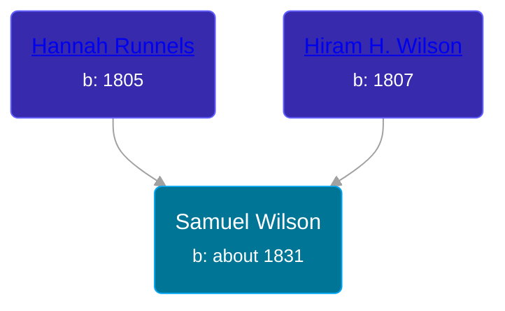

## 🔵 Samuel Wilson

Son of [Hiram H. Wilson](/people/8/82044077) and [Hannah Runnels](/people/9/9135776)





### 📆 Events


Type | Date | Age at Event | Place
------ | ------ | ------ | ------
Birth | about 1831 |  | New York, USA
[Residence](#event-event-0) | 16 AUG 1860 | 29y, 8m, 16d | Galen, Wayne, New York, USA
[Residence](#event-event-1) | 01 JUL 1863 | 32y, 7m, 1d | Galen, Wayne, New York, USA
[Residence](#event-event-2) | 01 AUG 1870 | 39y, 8m, 1d | Galen, Wayne, New York, USA



- **Birth**
**Date**: about 1831, Age:
**Place**: New York, USA
- **[Residence](#event-event-0)**
**Date**: 16 AUG 1860, Age: 29y, 8m, 16d
**Place**: Galen, Wayne, New York, USA
- **[Residence](#event-event-1)**
**Date**: 01 JUL 1863, Age: 32y, 7m, 1d
**Place**: Galen, Wayne, New York, USA
- **[Residence](#event-event-2)**
**Date**: 01 AUG 1870, Age: 39y, 8m, 1d
**Place**: Galen, Wayne, New York, USA


## 👩‍❤️‍👨 Relationships

### 🟣 [Caroline ](/people/4/42501514), b. abt 1842

#### Children With Caroline
* 🟣 [Hannah M. Wilson](/people/9/97992363), b. about 1859
* 🔵 [Thomas J. Wilson](/people/5/56990191), b. about 1861
* 🔵 [Fred Wilson](/people/4/44161340), b. about 1868
* 🔵 [George E. Wilson](/people/5/52481817), b. about 1869
### 📰 Event Sources

####  Residence, 16 AUG 1860
* 1860 US Census
>
  > Name: Samuel Wilson
  > Age: 29
  > Birth Year: abt 1831
  > Gender: Male
  > Race: White
  > Birth Place: New York
  > Home in 1860: Galen, Wayne, New York
  > Dwelling Number: 921
  > Family Number: 915
  > Occupation: Day Laborer
  >
  > Household members:
  > Hiram Wilson, 53
  > Hannah Wilson, 55
  > Samuel Wilson, 29
  > Caroline Wilson, 18
  > Hannah M Wilson, 9/12
  >

####  Residence, 01 JUL 1863
* U.S., Civil War Draft Registrations Records, 1863-1865
>
  > Name:Samuel Wilson
  > Birth Year:abt 1831
  > Place of Birth:New York
  > Age on 1 July 1863:32
  > Race:White
  > Marital status:Married
  > Occupation: Boatman
  > Residence:Galen, New York
  > Congressional District:24th
  > Class:1

####  Residence, 01 AUG 1870
* 1870 US Census
>
  > 1870 US Census
  > Town of Galen, Wayne, New York
  >
  > 1 Aug 1870
  >
  > Dwelling Number: 662
  > Family Number: 623
  >
  > Name: Samuel Wilson
  > Age: 39
  > Sex: Male
  > Race: White
  > Occupation: Well Digger
  > Birthplace: New York
  >
  > Name: Caroline F. Willson
  > Age: 28
  > Sex: Female
  > Race: White
  > Occupation: Keeping House
  > Birthplace: Connecticut
  >
  > Name: Thomas J. Wilson
  > Age: 9
  > Sex: Male
  > Race: White
  > Occupation: At School
  > Birthplace: New York
  >
  > Name: Fred Wilson
  > Age: 2
  > Sex: Male
  > Race: White
  > Birthplace: New York
  >
  > Name: George E. Wilson
  > Age: 1
  > Sex: Male
  > Race: White
  > Birthplace: New York
  >
