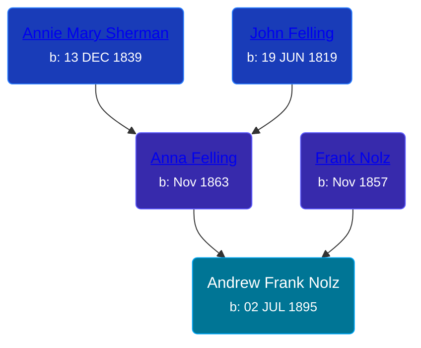

## 🔵 Andrew Frank Nolz
<small>Age: 65y, 7m, 5d</small>

Son of [Frank Nolz](/people/6/61628928) and [Anna Felling](/people/1/1735561)





### 📆 Events


Type | Date | Age at Event | Place
------ | ------ | ------ | ------
[Birth](#event-event-2) | 02 JUL 1895 |  | St Paul, Ramsey, Minnesota, USA
[Residence](#event-event-0) | 06 JUN 1900 | 4y, 11m, 4d | St Paul, Ramsey, Minnesota, USA
[Residence](#event-event-1) | 02 MAY 1910 | 14y, 10m | St Paul, Ramsey, Minnesota, USA
[Death](#event-event-5) | 07 FEB 1961 | 65y, 7m, 5d | Hennepin, Minnesota, USA



- **[Birth](#event-event-2)**
**Date**: 02 JUL 1895, Age:
**Place**: St Paul, Ramsey, Minnesota, USA
- **[Residence](#event-event-0)**
**Date**: 06 JUN 1900, Age: 4y, 11m, 4d
**Place**: St Paul, Ramsey, Minnesota, USA
- **[Residence](#event-event-1)**
**Date**: 02 MAY 1910, Age: 14y, 10m
**Place**: St Paul, Ramsey, Minnesota, USA
- **[Death](#event-event-5)**
**Date**: 07 FEB 1961, Age: 65y, 7m, 5d
**Place**: Hennepin, Minnesota, USA


### 📰 Event Sources

####  Birth, 02 JUL 1895
* U.S., World War I Draft Registration Cards, 1917-1918

####  Residence, 06 JUN 1900
* 1900 US Census

####  Residence, 02 MAY 1910
* 1910 US Census

####  Death, 07 FEB 1961
* Minnesota, Death Index, 1908-2002