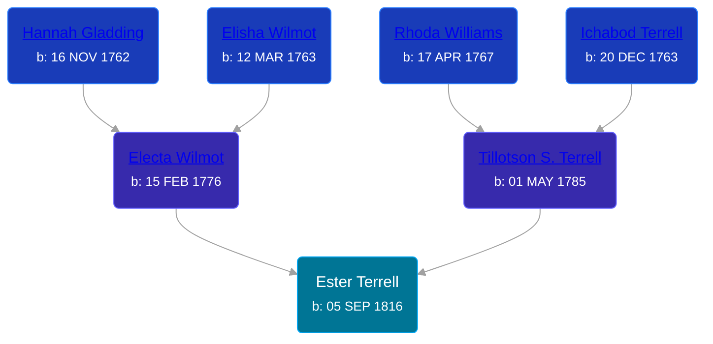

## 🟣 Ester Terrell

Daughter of [Tillotson S. Terrell](/people/2/25548435) and [Electa Wilmot](/people/7/77370498)





### 📆 Events


Type | Date | Age at Event | Place
------ | ------ | ------ | ------
Birth | 05 SEP 1816 |  |



- **Birth**
**Date**: 05 SEP 1816, Age:
**Place**:

