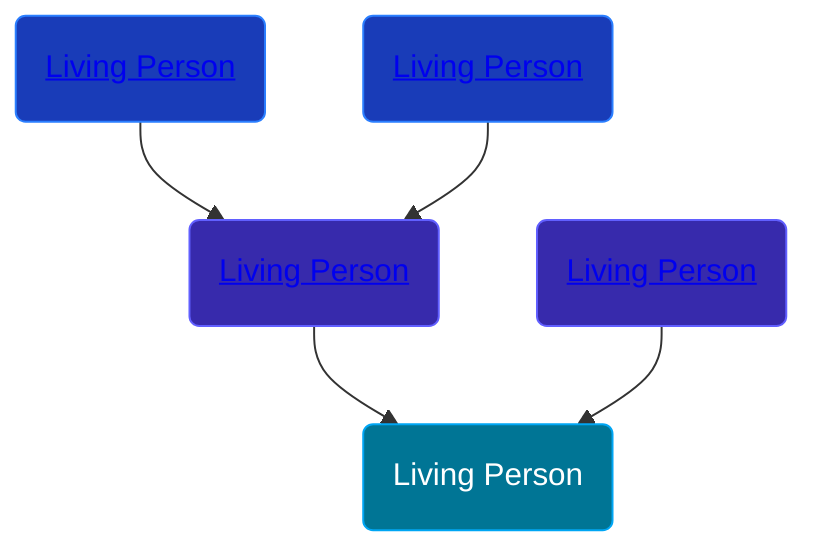

## 🔵 Living Person

Son of [Living Person](/people/3/33561872) and [Living Person](/people/9/95526608)





## 👩‍❤️‍👨 Relationships

### 🟣 [Living Person](/people/9/97672136)

#### Children With Living Person
* 🔵 [Living Person](/people/9/94045846)