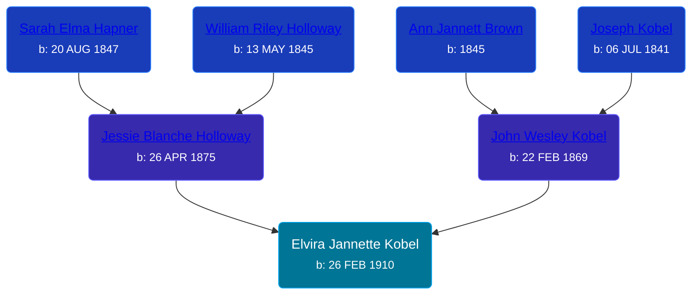

## 🟣 Elvira Jannette Kobel
<small>Age: 94y, 7m, 19d</small>

Daughter of [John Wesley Kobel](/people/2/24649136) and [Jessie Blanche Holloway](/people/2/29242864)





### 📆 Events


Type | Date | Age at Event | Place
------ | ------ | ------ | ------
[Birth](#event-event-2) | 26 FEB 1910 |  | Elmira Township, Antrim, Michigan, USA
[Death](#event-event-3) | 15 OCT 2004 | 94y, 7m, 19d |



- **[Birth](#event-event-2)**
**Date**: 26 FEB 1910, Age:
**Place**: Elmira Township, Antrim, Michigan, USA
- **[Death](#event-event-3)**
**Date**: 15 OCT 2004, Age: 94y, 7m, 19d
**Place**:


### 📰 Event Sources

####  Birth, 26 FEB 1910
* The Grand Rapids Press

####  Death, 15 OCT 2004
* The Grand Rapids Press
>   
  > KOLK -- Elvira J. Kolk, age 94, of Chippewa Lake, formerly of the Grand Rapids area, passed away Friday, October 15, 2004. She was born February 26, 1910 in Elmira, MI to John and Jessie (Holloway) Kobel. She is survived by her loving family, including: Donald (Wilma) Mekkes of Rodney; sister, Jessie Gould Freelan of Chippewa Lake; many nieces and nephews. Funeral services will take place 2:00 p.m. Monday, October 18th at the Daggett-Gilbert Funeral Home in Big Rapids. The family will greet friends on Sunday at the funeral home from 2:00 p.m. to 4:00 p.m. and 7:00 p.m. to 9:00 p.m.