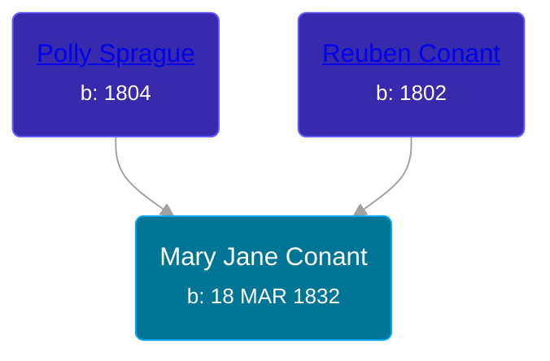

## 🟣 Mary Jane Conant
<small>Age: 68y, 12d</small>

Daughter of [Reuben Conant](/people/7/72221832) and [Polly Sprague](/people/5/53927626)





### 📆 Events


Type | Date | Age at Event | Place
------ | ------ | ------ | ------
Birth | 18 MAR 1832 |  | New York, New York, United States
[Residence](#event-event-0) | 30 SEP 1850 | 18y, 6m, 12d | Savannah, Wayne, New York, USA
[Residence](#event-event-1) | 21 AUG 1860 | 28y, 5m, 3d | Butler, Wayne, New York, USA
[Residence](#event-event-2) | 04 SEP 1870 | 38y, 5m, 16d | Allendale, Ottawa, Michigan, USA
[Residence](#event-event-3) | 1894 | 61y, 8m, 12d | Tyrone Township, Kent, Michigan, USA
[Death](#event-event-8) | 30 MAR 1900 | 68y, 12d | Tyrone Township, Kent, Michigan, USA



- **Birth**
**Date**: 18 MAR 1832, Age:
**Place**: New York, New York, United States
- **[Residence](#event-event-0)**
**Date**: 30 SEP 1850, Age: 18y, 6m, 12d
**Place**: Savannah, Wayne, New York, USA
- **[Residence](#event-event-1)**
**Date**: 21 AUG 1860, Age: 28y, 5m, 3d
**Place**: Butler, Wayne, New York, USA
- **[Residence](#event-event-2)**
**Date**: 04 SEP 1870, Age: 38y, 5m, 16d
**Place**: Allendale, Ottawa, Michigan, USA
- **[Residence](#event-event-3)**
**Date**: 1894, Age: 61y, 8m, 12d
**Place**: Tyrone Township, Kent, Michigan, USA
- **[Death](#event-event-8)**
**Date**: 30 MAR 1900, Age: 68y, 12d
**Place**: Tyrone Township, Kent, Michigan, USA


## 👩‍❤️‍👨 Relationships

### 🔵 [Edmund Holloway Wilson](/people/6/67777324), b. 22 JUL 1829

#### Events


Type | Date | Age at Event | Place
------ | ------ | ------ | ------
[Marriage](#event-family-0-event-0) | 02 SEP 1849 | 17y, 5m, 14d | Savannah, Wayne, New York, USA



- **[Marriage](#event-family-0-event-0)**
**Date**: 02 SEP 1849, Age: 17y, 5m, 14d
**Place**: Savannah, Wayne, New York, USA


#### Children With Edmund Holloway Wilson
* 🟣 [Mary Jane Wilson](/people/6/68306241), b. 1850
* 🟣 [Polly Ann Wilson](/people/9/97244328), b. abt 1853
* 🔵 [James E. Wilson](/people/5/54950695), b. 11 APR 1856
* 🟣 [Leora E. Wilson](/people/2/22233872), b. about 1867
* 🔵 [Joseph Evart Wilson](/people/5/57306025), b. May 1871
### 📰 Event Sources

####  Marriage, 02 SEP 1849
* Wayne County, New York Marriages
>   
  > Date: 02 Sep 1849  
  > Groom: Edward Wilson  
  > Residence: Savannah  
  > Age: 25  
  > Bride: Mary Conant  
  > Residence: Savannah  
  > Age: 20  
  > Official: Revd. Samuel Goff

####  Residence, 30 SEP 1850
* 1850 US Census
>   
  > Name: Mary Wilson  
  > Gender: Female  
  > Race: White  
  > Residence Age: 18  
  > Birth Date: abt 1832  
  > Birthplace: New York  
  > Residence Date: 1850  
  > Home in 1850: Savannah, Wayne, New York, USA  
  > Line Number: 37  
  > Dwelling Number: 264  
  > Family Number: 264  
  >   
  > Household members:  
  > Reuben Conant, 47  
  > Polly Conant, 45  
  > Sally A Conant, 15  
  > Reuben S Conant, 10  
  > James Conant, 6  
  > Edwin Wilson, 21  
  > Mary Wilson, 18

####  Residence, 21 AUG 1860
* 1860 US Census
>   
  > Name: Mary Wilson  
  > Age: 27  
  > Birth Year: abt 1833  
  > Gender: Female  
  > Race: White  
  > Birth Place: New York  
  > Home in 1860: Butler, Wayne, New York  
  > Post Office: West Butler  
  > Dwelling Number: 830  
  > Family Number: 810  
  >   
  > Household members:  
  > Edmund Wilson, 30  
  > Mary Wilson, 27  
  > Mary J Wilson, 9  
  > Polly A Wilson, 6  
  > James Wilson, 3

####  Residence, 04 SEP 1870
* 1870 US Census
>   
  > Name: Mary Wilson  
  > Age in 1870: 37  
  > Birth Date: abt 1833  
  > Birthplace: New York  
  > Dwelling Number: 10  
  > Home in 1870: Allendale, Ottawa, Michigan  
  > Race: White  
  > Gender: Female  
  > Post Office: Holland  
  > Occupation: Keeping House  
  >   
  > Household members:  
  > Edwin Wilson, 41  
  > Mary Wilson, 37  
  > Polly Wilson, 16  
  > James Wilson, 13

####  Residence, 1894
* 1894 Michigan State Census
>   
  > Name: Mary Wilson  
  > Sex: Female  
  > Age: 62  
  > Residence Place: Tyrone, Kent, Michigan, United States  
  > Relationship to Head of Household: Wife  
  > Event Type: Census  
  > Event Place: Tyrone, Kent, Michigan, United States  
  > Event Place (Original): Tyrone, Kent, Michigan, United States  
  > Line Number: 16  
  > Page Number: 49  
  > Microfilm Number: 984228  
  > Indexing Batch: N04014-5  
  >   
  > Household members:  
  > Edmund Wilson, M, 65  
  > Mary Wilson, F, 62  
  > Evert J. Wilson, M, 23

####  Death, 30 MAR 1900
* Michigan, Death Records, 1867-1950
>   
  > Name: Mary J Wilson  
  > Gender: Female  
  > Race: White  
  > Marital Status: Married  
  > Death Age: 68  
  > Birth Date: 18 Mar 1832  
  > Birth Place: York State  
  > Death Date: 30 Mar 1900  
  > Death Place: Tyrone, Kent, Michigan, USA  
  > Father: Ruben Conant  
  > Mother: Polly Sprauge  
  > File Number: 453